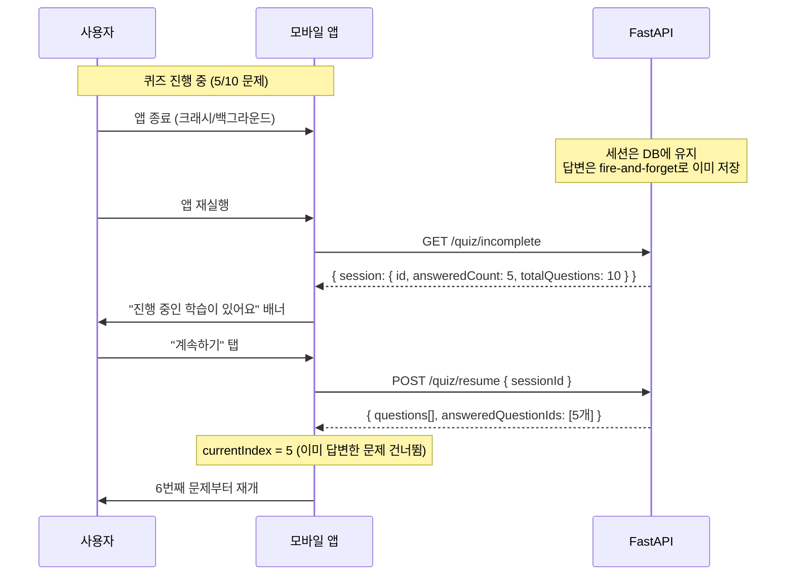
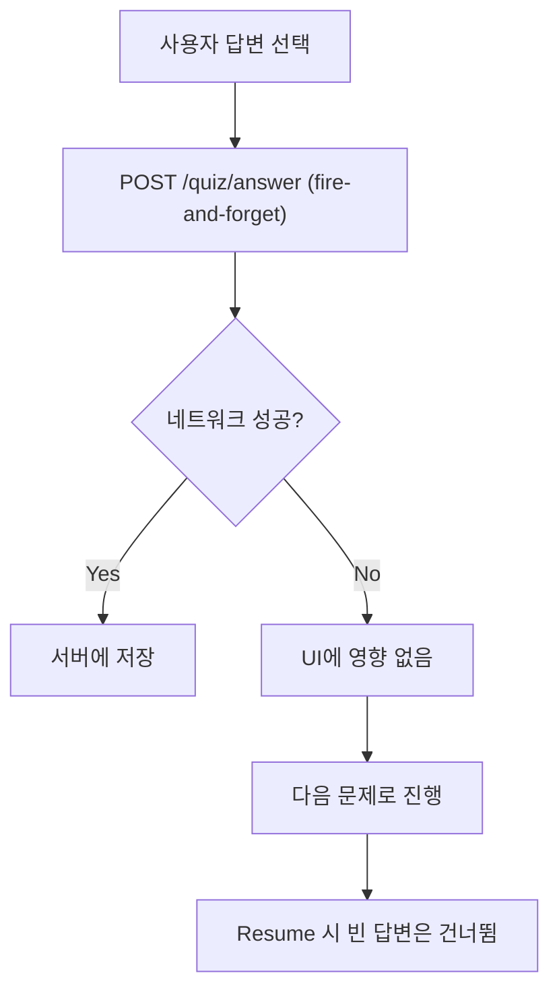
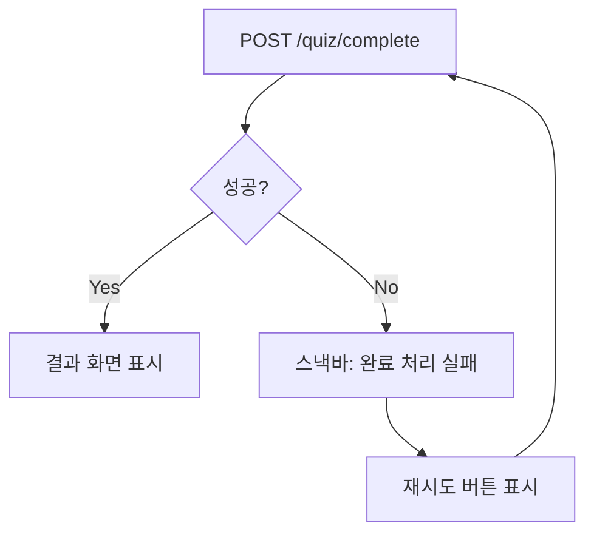
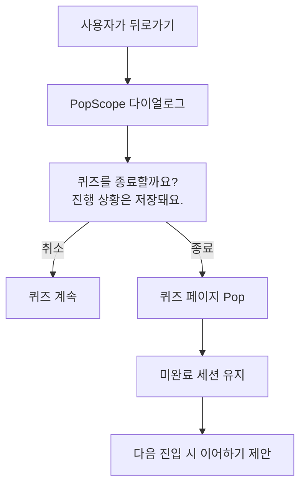
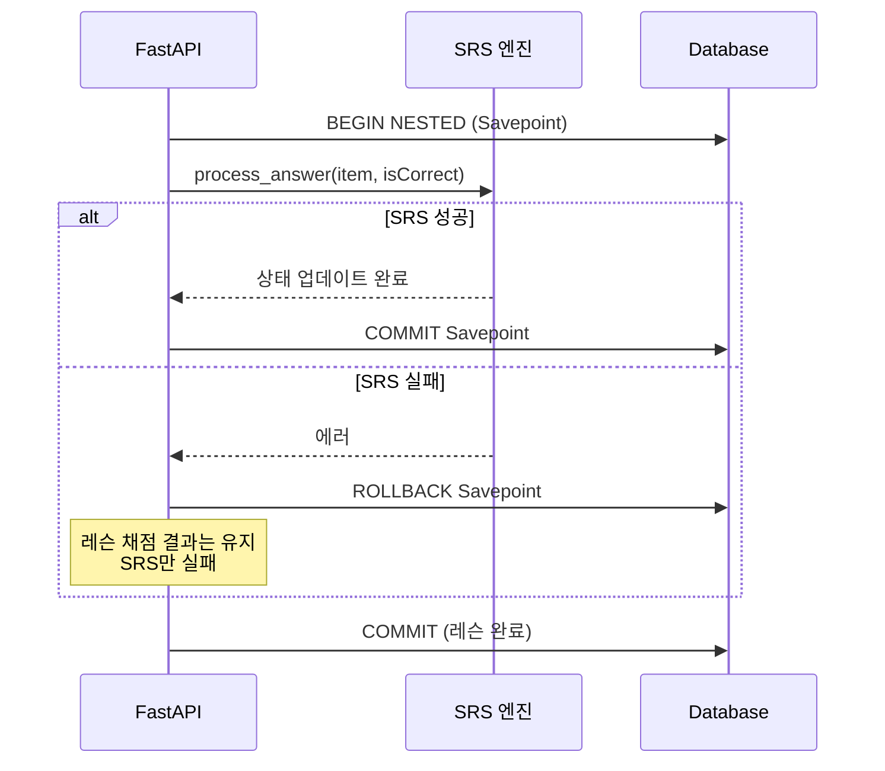
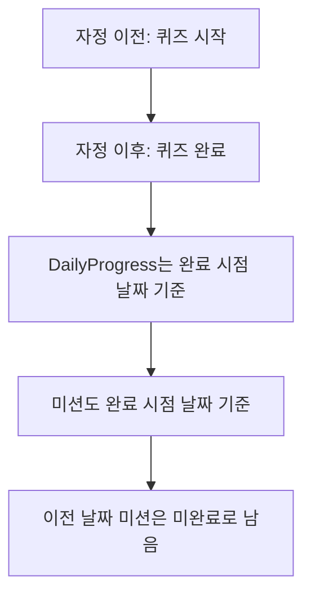

# 엣지 케이스 & 복구 플로우

> **Canonical**: Mobile

---

## 1. 퀴즈 중단/복구

### 시나리오: 퀴즈 도중 앱 종료



### 자동 정리 규칙
| 조건 | 처리 |
|------|------|
| 답변 0개 + 미완료 | 좀비 세션 → 자동 완료 처리 |
| 시작 후 24시간 경과 | 스테일 세션 → 자동 완료 처리 |
| 새 퀴즈 시작 시 미완료 존재 | 기존 세션 자동 완료 + XP 정산 |

### 멱등성 보장
```
POST /quiz/complete 재호출 시:
  session.completed_at이 이미 존재 → xp_earned: 0 반환 (중복 XP 방지)
```

---

## 2. 네트워크 에러

### 답변 전송 실패



- `/quiz/answer`는 await 없이 전송 → **네트워크 실패가 UI를 블로킹하지 않음**
- 일부 답변이 누락될 수 있지만, 퀴즈 진행에는 영향 없음
- 완료 시 서버 기준 `correctCount`로 정산

### 퀴즈 완료 전송 실패



### 레슨 제출 실패
- `/lessons/{id}/submit` 실패 시 에러 표시
- 답안은 로컬에 보존 → 재시도 가능

---

## 3. 퀴즈 도중 뒤로가기



---

## 4. 레슨 도중 뒤로가기

| 현재 Step | 뒤로가기 동작 |
|-----------|-------------|
| Context Preview (Step 0) | 시스템 뒤로가기 허용 → 레슨 목록으로 |
| 나머지 Step (1~5) | `goBack()` → 이전 Step으로 |
| Result (Step 5) | "완료" 버튼만 → 레슨 목록으로 |

---

## 5. SRS 처리 실패

### 레슨 제출 시 SRS 격리



- Savepoint 사용으로 **SRS 실패가 레슨 완료를 차단하지 않음**
- SRS 등록 실패 시: 레슨은 COMPLETED, SRS는 미등록 (다음 기회에 재등록)

---

## 6. 동시 세션

### 같은 유저가 여러 디바이스에서 퀴즈

| 시나리오 | 동작 |
|---------|------|
| 디바이스 A에서 퀴즈 시작 → 디바이스 B에서 새 퀴즈 시작 | A의 세션이 자동 완료됨 |
| 디바이스 A에서 퀴즈 진행 중 → B에서 /incomplete 호출 | A의 세션이 반환됨 |

- `/quiz/start` 호출 시 기존 미완료 세션이 자동 완료됨
- XP는 자동 완료된 세션의 정답 수 기준으로 정산

---

## 7. 데일리 미션 엣지 케이스

### 날짜 변경 (자정)



### 미션 생성 시점
- `GET /missions/today` 호출 시 해당 날짜 미션이 없으면 자동 생성
- 결정론적 알고리즘: `md5(date + userId)` → 같은 날 같은 유저 = 항상 같은 미션

---

## 8. 가나 퀴즈 특수 케이스

### 스테이지 퀴즈 vs 마스터 퀴즈

| 상황 | 동작 |
|------|------|
| 스테이지 퀴즈 통과 | 다음 스테이지 잠금해제 |
| 스테이지 퀴즈 미통과 | 같은 스테이지 재시도 가능 |
| 마스터 퀴즈 완료 | 업적 부여 (kana_hiragana_complete 등) |
| 이미 완료된 스테이지 재시도 | 점수 갱신, 잠금해제 변경 없음 |

---

> **Web MVP Delta**: Web에서는 미완료 세션 이어하기가 동일하게 동작. 레슨 관련 엣지 케이스는 해당 없음.
