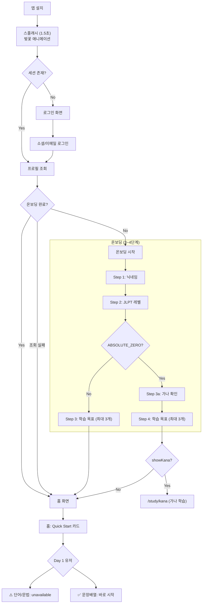
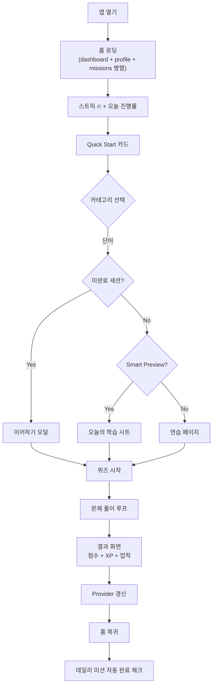
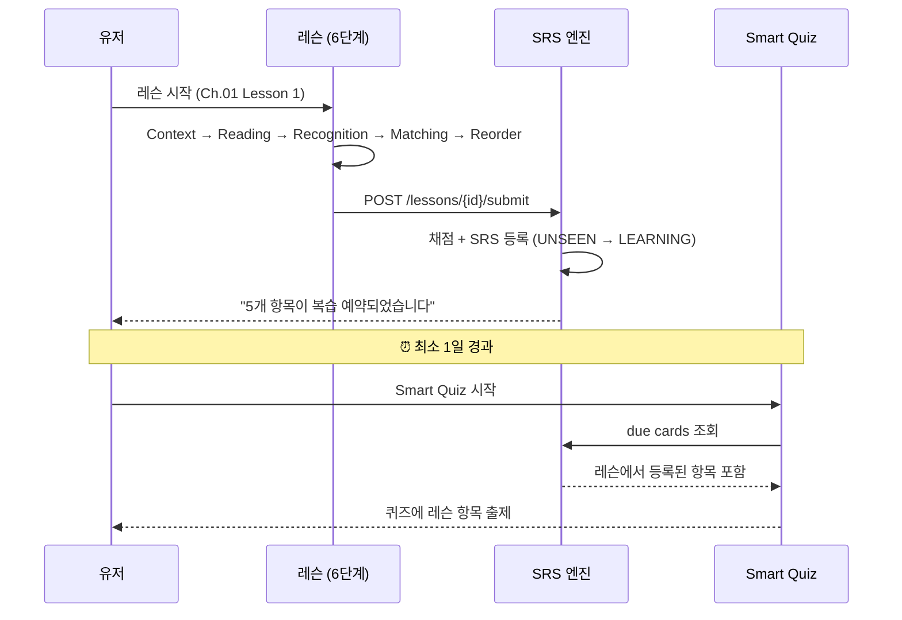
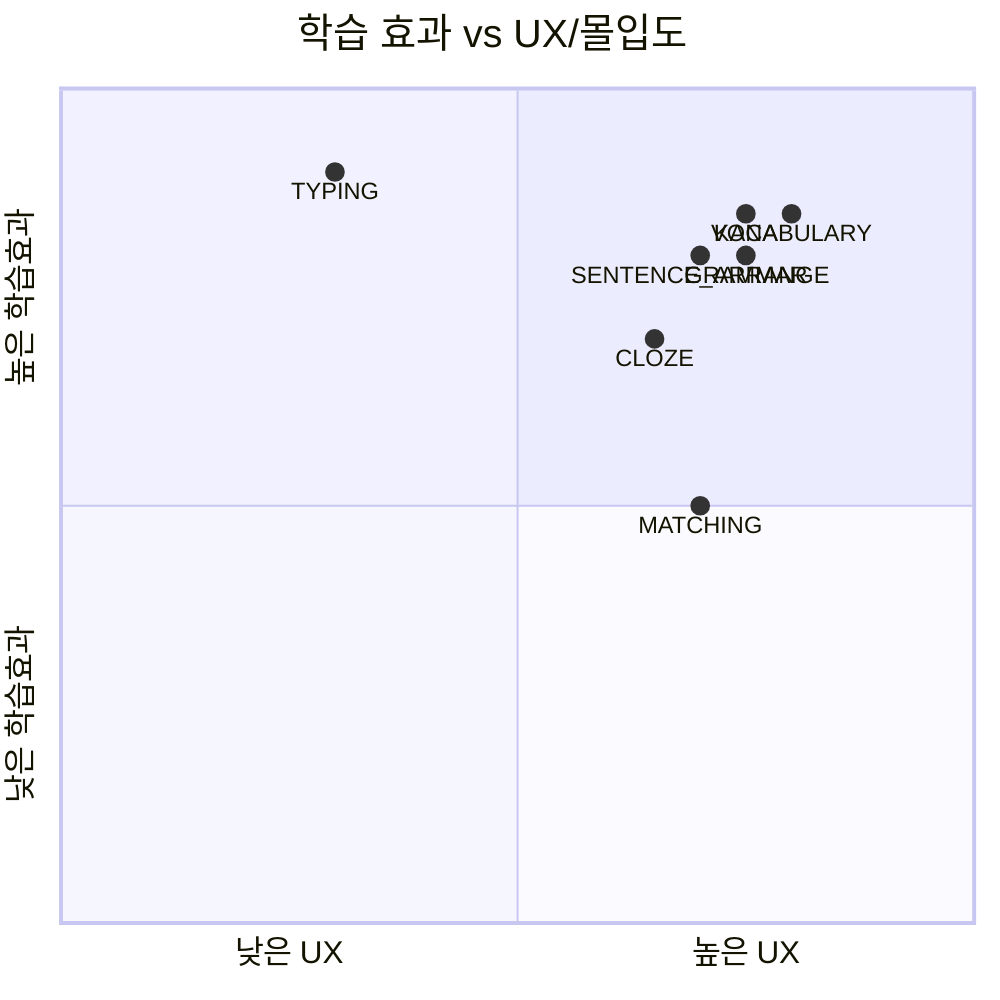
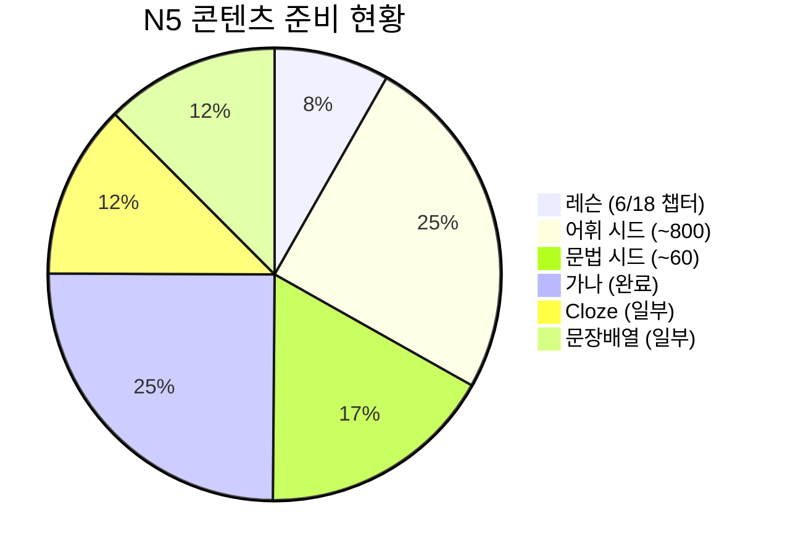

# 하루코토 학습 플로우 분석 & 평가 보고서

> **작성일**: 2026-03-25
> **분석 방법**: Claude Code + Codex MCP 교차 검증
> **분석 기준**: Mobile(Flutter) 코드 트레이스 + FastAPI 백엔드 로직
> **관점**: "진짜 일본어를 배우려는 한국인 유저" 시뮬레이션

---

## 목차

1. [Day 1 유저 여정](#1-day-1-유저-여정)
2. [일상 학습 루틴 (Day 7+)](#2-일상-학습-루틴-day-7)
3. [레슨 → 퀴즈 연결 경험](#3-레슨--퀴즈-연결-경험)
4. [퀴즈 카테고리 경험](#4-퀴즈-카테고리-경험)
5. [장기 진행 (N5 → N4)](#5-장기-진행-n5--n4)
6. [경쟁 앱 대비 분석](#6-경쟁-앱-대비-분석)
7. [우선순위별 개선 사항](#7-우선순위별-개선-사항)

---

## 1. Day 1 유저 여정

### 전체 플로우

### 평가

#### 강점
- **온보딩이 간결함** — 닉네임 → 레벨 → 목표, 최소 3단계로 유저 의도 파악
- **ABSOLUTE_ZERO 자동 유도** — 초보자 선택 시 가나 학습으로 자동 이동. "히라가나도 모르는데 뭘 하지?" 혼란 방지
- **목표 복수 선택** — 최대 3개 선택으로 유저 동기를 다면적으로 파악
- **스플래시 감성** — 벚꽃 애니메이션 + "매일 한 단어, 봄처럼 피어나는 나의 일본어" 타글라인이 브랜드 톤 전달

#### 문제점

| 이슈 | 심각도 | 근거 |
|------|:------:|------|
| **Day 1 Quick Start가 막혀있음** | **P1** | VOCABULARY/GRAMMAR Smart Preview 없으면 `unavailable`. 첫날 메인 기능 사용 불가 |
| **온보딩 완료 후 "다음 행동" CTA 없음** | P1 | N5+ 유저는 홈으로 이동하지만 "이제 뭘 하지?" 상태. 명시적 첫 학습 안내 없음 |
| **프로필 조회 실패 → 온보딩 스킵** | P2 | `catch (_) → context.go('/home')` — 미완료 유저가 빈 홈을 볼 수 있음 |
| **스플래시 1.5초 고정** | P3 | 세션 만료 시 로그인 화면까지 1.5초 + 로그인 시간. 재방문 유저에게 불필요한 대기 |

#### 개선 제안

1. **Day 1 유저용 "첫 학습" 퀴즈 제공** — Smart Preview 없어도 N5 기본 10문제 퀴즈를 제공
2. **온보딩 완료 → "첫 레슨 시작하기" CTA 강제 노출** — 홈 상단에 원타임 배너
3. **프로필 조회 실패 시 `/onboarding` fallback** — `context.go('/home')` → `context.go('/onboarding')`
4. **재방문 유저 스플래시 단축** — 유효 세션 시 0.8초로 줄이기

---

## 2. 일상 학습 루틴 (Day 7+)

### 전체 플로우

### 평가

#### 강점
- **홈 원스톱** — 스트릭, 미션, Quick Start가 한 화면에 모여 "오늘 할 일" 명확
- **Smart Quiz 자동 선별** — SRS 기반 due cards + new cards 자동 혼합. 유저가 뭘 공부할지 고민 불필요
- **결정론적 미션** — `md5(date + userId)` 기반. 같은 날 같은 유저 = 항상 같은 미션. 공정성 보장
- **Fire-and-forget 답변** — 네트워크 느려도 UI 안 막힘. 모바일 환경에 적합한 설계

#### 문제점

| 이슈 | 심각도 | 근거 |
|------|:------:|------|
| **`conversation_count` DailyProgress 미반영** | **P0** | chat.py에서 `xp_earned`, `study_minutes`만 upsert. `conversation_count` 누락 → `chat_1`/`chat_2` 미션 영구 미완료 |
| **미션 달성 순간 피드백 없음** | P2 | XP 자동 지급은 `/missions/today` 호출 시. 유저는 "달성!" 순간을 체감 못 함 |
| **주간 차트가 회고형** | P3 | 과거 데이터만 보여줌. "오늘 더 해야 한다"는 동기 부여 약함 |

#### 개선 제안

1. **`conversation_count` 버그 수정** (P0) — `chat.py` DailyProgress upsert에 `conversation_count` 추가
2. **미션 달성 인앱 토스트** — 미션 조건 충족 시 즉시 축하 애니메이션 ("미션 완료! +15 XP")
3. **"오늘 목표까지 N개 남았어요"** 프로그레스를 홈 상단에 강조

---

## 3. 레슨 → 퀴즈 연결 경험

### 연결 플로우

### 평가

#### 강점
- **결과 화면에 SRS 상태 표시** — "N개 복습 예약" + 상태 전이(Before→After) + 다음 복습 날짜. 연결 체감 좋음
- **Savepoint 격리** — SRS 실패해도 레슨 완료는 보장. 안정적
- **PROVISIONAL 스킵** — 레슨 항목은 큐레이팅된 콘텐츠 → 바로 LEARNING 진입. 합리적 설계

#### 문제점

| 이슈 | 심각도 | 근거 |
|------|:------:|------|
| **"바로 복습" 버튼 없음** | **P1** | 결과에 "다시 풀기"(같은 레슨) + "완료"(목록 복귀)만 있음. 방금 배운 걸 바로 퀴즈로 연결하는 루프 끊김 |
| **SRS → 퀴즈 최소 1일 대기** | P2 | 등록 직후 same-day 제외 로직 → "방금 배웠는데 왜 안 나와?" 혼란 |
| **Recognition 건너뛰기 가능** | P3 | Step 2 건너뛰기 허용 → 인지 확인 없이 매칭으로 넘어감. 학습 효과 감소 |

#### 개선 제안

1. **레슨 결과에 "바로 복습" 버튼 추가** — 방금 배운 항목으로 즉시 퀴즈 시작 (`openReviewQuiz` 활용)
2. **레슨 완료 당일은 same-day 예외 허용** — `introduced_by = LESSON`인 항목은 당일 Smart Quiz에도 포함
3. **Recognition 건너뛰기 시 안내** — "연습을 건너뛰면 복습 효과가 줄어요" 토스트

---

## 4. 퀴즈 카테고리 경험

### 카테고리별 평가

| 카테고리 | 학습 효과 | UX/몰입도 | SRS 연동 | 종합 평가 |
|---------|:--------:|:--------:|:--------:|----------|
| **VOCABULARY** | ★★★★★ | ★★★★ | ✅ | 핵심 퀴즈. Smart+SRS로 장기 기억 효과 높음 |
| **GRAMMAR** | ★★★★ | ★★★★ | ✅ | VOCABULARY와 동일 구조. 안정적 |
| **MATCHING** | ★★★ | ★★★★ | ✅ | 게임성 좋음. 타이머 없어 긴장감 부족 |
| **CLOZE** | ★★★★ | ★★★★ | ❌ | 문맥 이해 훈련. **SRS 미연동이 아쉬움** |
| **SENTENCE_ARRANGE** | ★★★★★ | ★★★★ | ❌ | 어순 이해에 효과적. **SRS 미연동이 아쉬움** |
| **KANA** | ★★★★★ | ★★★★ | 별도 | 스테이지 시스템으로 진행감 좋음. 별도 트랙 |
| **TYPING** | ★★★★★ | - | ✅ | 회상 훈련 최고. **현재 비활성화** |

### 핵심 문제

| 이슈 | 심각도 | 설명 |
|------|:------:|------|
| **CLOZE/SENTENCE_ARRANGE SRS 미연동** | P2 | 열심히 풀어도 장기 복습에 반영 안 됨. 유저는 이 사실을 모름 |
| **카테고리 진입 분산** | P2 | VOCAB/GRAMMAR는 홈, KANA는 별도 탭, MATCHING/CLOZE/ARRANGE는 모드 선택. "7종류를 어디서 찾지?" |
| **TYPING 비활성화** | P3 | 회상(recall) 훈련 효과가 가장 높은 유형인데 비활성 |

### 개선 제안

1. **CLOZE/SENTENCE_ARRANGE에 "스킬 훈련" 라벨 명시** — SRS 비연동 사실을 투명하게 안내
2. **퀴즈 허브 통합** — 모든 카테고리/모드를 한 화면에서 선택 가능하게
3. **TYPING 재활성화 검토** — 회상 훈련은 학습 효과 최고

---

## 5. 장기 진행 (N5 → N4)

### 현재 N5 콘텐츠 커버리지

### 평가

#### 강점
- 레벨/스테이지/챕터 구조가 이미 준비됨 — API, DB 모델, 라우팅 모두 존재
- XP → 레벨 시스템 (`level = floor(sqrt(XP/100)) + 1`) — 성장 체감 가능
- 업적 시스템 (퀴즈 수, 스트릭, 단어 수, 레벨 기반) — 마일스톤 동기 부여

#### 문제점

| 이슈 | 심각도 | 설명 |
|------|:------:|------|
| **N5 콘텐츠만 실질적으로 존재** | P1 | 레슨 6챕터/18, 스테이지 31개. N4+ 시드 데이터 부재 |
| **"N5 완료도" 시각화 없음** | P2 | 어휘 N/800, 문법 N/88, 레슨 N/90 같은 전체 진행률 미표시 |
| **N4 전환 시 가드 없음** | P2 | 빈 콘텐츠가 노출될 수 있음. "준비 중" 안내 없음 |
| **MASTERED 비율 미표시** | P3 | SRS MASTERED 상태 항목 비율을 유저가 볼 수 없음 |

#### 개선 제안

1. **N4+ 선택 시 "콘텐츠 준비 중" 가드** — 로드맵 표시 + 기대치 관리
2. **"N5 완료도" 대시보드** — 어휘/문법/레슨/가나 각각의 마스터리 비율 시각화
3. **MASTERED 비율 표시** — "단어 마스터: 45/800 (5.6%)" 같은 진행 지표

---

## 6. 경쟁 앱 대비 분석

### 비교 매트릭스

| 비교 항목 | 하루코토 | Duolingo | Anki | WaniKani |
|----------|:-------:|:--------:|:----:|:-------:|
| **레슨+퀴즈+회화 통합** | ★★★★★ | ★★★ | ★ | ★★ |
| **SRS 정교함** | ★★★ | ★★★ | ★★★★★ | ★★★★ |
| **한국어 네이티브 지원** | ★★★★★ | ★★ | ★★★ | ★ |
| **콘텐츠 깊이** | ★★ | ★★★ | ★★★★★ | ★★★★ |
| **게이미피케이션** | ★★★ | ★★★★★ | ★ | ★★★ |
| **성장 가시성** | ★★ | ★★★★★ | ★★★ | ★★★★ |
| **AI 회화 연습** | ★★★★★ | ★ | ★ | ★ |
| **JLPT 특화** | ★★★★★ | ★ | ★★★ | ★★ |

### 차별점 (강점)

1. **올인원 학습 루프** — "레슨 → SRS 퀴즈 → AI 회화"를 하나의 앱에서 완결. 경쟁 앱은 각각 별도 앱 필요
2. **한국인 특화** — 한국어 네이티브 UX, 한일 번역 기반 학습, 한국인 학습 패턴 반영
3. **JLPT 직결** — N5~N1 체계적 커리큘럼. Duolingo는 JLPT 매핑 없음
4. **AI 실전 회화** — 시나리오 기반 대화 + 음성 통화. 다른 학습 앱에 없는 기능

### 부족한 점

1. **성장 가시성** (vs Duolingo) — Duolingo는 리그, 보석, 친구 경쟁 등으로 매일 돌아오게 만듦. 하루코토는 스트릭+미션+업적이 있지만 소셜/경쟁 요소 부재
2. **SRS 정교함** (vs Anki) — Anki는 FSRS로 최적화된 반복 간격. 하루코토는 SM-2 + PROVISIONAL (FSRS 전환 계획은 있으나 미적용)
3. **콘텐츠 깊이** (vs WaniKani) — WaniKani는 한자 2000+자 체계적 커버. 하루코토는 N5 중심으로 상위 레벨 부재
4. **커뮤니티 부재** — 모든 경쟁 앱은 포럼/커뮤니티가 있음. 하루코토는 개인 학습만

---

## 7. 우선순위별 개선 사항

### P0 — 즉시 수정 (버그)

| # | 이슈 | 영향 | 수정 범위 |
|:-:|------|------|----------|
| 1 | **`conversation_count` DailyProgress 미반영** | chat 미션 영구 미완료 | `chat.py` DailyProgress upsert 1줄 추가 |

### P1 — 단기 수정 (핵심 UX)

| # | 이슈 | 영향 | 수정 범위 |
|:-:|------|------|----------|
| 2 | **Day 1 Quick Start unavailable** | 첫날 메인 기능 사용 불가 → 이탈 | Smart Preview 없을 때 기본 퀴즈 제공 로직 |
| 3 | **레슨 결과 → "바로 복습" CTA 없음** | 학습 루프 끊김 | 결과 페이지에 버튼 1개 추가 |
| 4 | **온보딩 → 첫 학습 안내 없음** | "이제 뭘 하지?" 혼란 | 홈 원타임 배너 or 온보딩 마지막 단계에 CTA |
| 5 | **N5 외 콘텐츠 부재** | N4+ 선택 유저 빈 화면 | "준비 중" 가드 + 로드맵 |

### P2 — 중기 개선

| # | 이슈 | 영향 | 수정 범위 |
|:-:|------|------|----------|
| 6 | CLOZE/SENTENCE_ARRANGE SRS 미연동 라벨링 | 유저 기대 불일치 | UI 라벨 추가 |
| 7 | "N5 완료도" 대시보드 | 성장 체감 부족 | 통계 API + UI |
| 8 | 미션 달성 인앱 축하 | 보상 체감 부족 | 토스트/애니메이션 |
| 9 | 프로필 조회 실패 → 온보딩 fallback | 엣지 케이스 | 1줄 수정 |

### P3 — 장기 개선

| # | 이슈 | 영향 |
|:-:|------|------|
| 10 | TYPING 모드 재활성화 | 회상 훈련 효과 최고 |
| 11 | FSRS 전환 | SRS 정교함 향상 |
| 12 | MASTERED 비율 시각화 | 장기 성장 체감 |
| 13 | 퀴즈 허브 통합 | 카테고리 탐색 간소화 |
| 14 | 재방문 스플래시 단축 | 복귀 UX 개선 |

---

## Codex 토론 요약

### 핵심 합의

1. **"초기 진입/일일 루틴은 강하고, 장기 성장 체감/데이터 일관성이 약하다"**
2. **가장 임팩트 큰 3가지**: conversation_count 버그 수정, Day 1 Quick Start 해소, 레슨→복습 CTA
3. **차별점**: 레슨+퀴즈+AI 회화 올인원 통합은 경쟁 앱 대비 유일한 강점
4. **부족한 점**: 성장 가시성 (Duolingo 대비), 콘텐츠 깊이 (N4+ 부재), 소셜/경쟁 요소 없음

### 코드 근거 (Codex 제시)

| 이슈 | 코드 위치 |
|------|----------|
| conversation_count 누락 | `apps/api/app/routers/chat.py:248-255` |
| Day 1 unavailable | `apps/mobile/lib/features/study/presentation/study_entry_flow.dart` |
| 프로필 실패 fallback | `apps/mobile/lib/core/router/post_auth_resolver.dart:20` |
| CLOZE SRS 미연동 | `apps/api/app/routers/quiz.py:745` |
| Smart 분배 | `apps/api/app/routers/quiz.py:176` |
