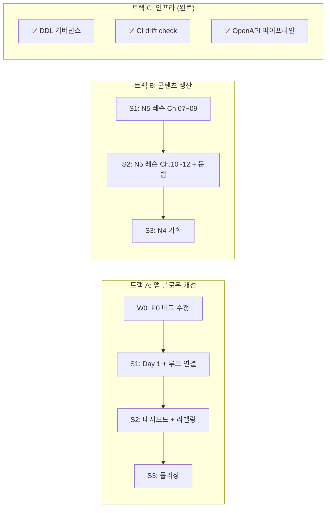
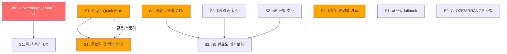

# 학습 플로우 개선 로드맵

> **작성일**: 2026-03-25
> **기반 문서**: `docs/flows/flow-analysis-2026-03-25.md`
> **검증**: Claude Code + Codex MCP 토론 합의

---

## 실행 원칙

> **"다음 기능의 성공률을 올리는 개선만 먼저"**

| 원칙 | 설명 |
|------|------|
| **콘텐츠 우선** | N5 완성도가 체감 성장에 직접 영향. 코드 개선은 콘텐츠 소비를 증폭하는 것만 우선 |
| **병렬 트랙** | 트랙 A(앱 플로우 개선) + 트랙 B(콘텐츠 생산)을 동시 진행 |
| **최소 구현** | P1은 UX/가드 중심 최소 구현. 대규모 리팩토링(FSRS, 허브 대개편)은 별도 프로젝트 |
| **측정 후 판단** | 배포 전 2주 baseline → 배포 후 2주 비교 |

---

## 타임라인 개요

```mermaid
gantt
    title 학습 플로우 개선 로드맵
    dateFormat YYYY-MM-DD
    axisFormat %m/%d

    section Week 0 (핫픽스)
    P0: conversation_count 버그 수정    :crit, w0, 2026-03-25, 2d

    section Sprint 1 (플로우 개선)
    P1: Day 1 Quick Start 해소          :s1a, after w0, 4d
    P1: 레슨→복습 CTA 추가             :s1b, after w0, 2d
    P1: 온보딩 첫 학습 안내             :s1c, after s1a, 2d
    P1: N5 외 콘텐츠 가드              :s1d, after s1b, 2d
    P2: 프로필 fallback 수정            :s1e, after w0, 1d
    P2: 미션 달성 축하 UX              :s1f, after s1c, 3d
    QA + 배포                          :s1q, after s1f, 2d

    section Sprint 2 (콘텐츠 + 개선)
    N5 레슨 확장 (Ch.07~12)            :s2a, after s1q, 7d
    N5 문법 추가 (~88개 완성)           :s2b, after s1q, 5d
    P2: N5 완료도 대시보드              :s2c, after s2b, 3d
    P2: CLOZE/ARRANGE 라벨링            :s2d, after s1q, 2d
    QA + 배포                          :s2q, after s2c, 2d

    section Sprint 3 (선택적)
    P3: MASTERED 비율 시각화            :s3a, after s2q, 3d
    P3: 스플래시 단축                   :s3b, after s2q, 1d
    N4 콘텐츠 기획                      :s3c, after s2q, 5d
```

---

## Week 0: 핫픽스 (2일)

### 작업

| # | 작업 | 수정 범위 | 코드 위치 |
|:-:|------|----------|----------|
| 1 | **`conversation_count` DailyProgress 반영** | `chat.py` upsert에 `conversation_count` 추가 | `apps/api/app/routers/chat.py:248-255` |

### 상세

chat 완료 시 DailyProgress에 `conversation_count`가 반영되지 않아 `chat_1`/`chat_2` 미션이 영구 미완료:

```python
# 현재 (chat.py, text chat end)
set_={
    "xp_earned": DailyProgress.xp_earned + xp,
    "study_minutes": func.coalesce(DailyProgress.study_minutes, 0) + chat_study_minutes,
}

# 수정 후
set_={
    "xp_earned": DailyProgress.xp_earned + xp,
    "study_minutes": func.coalesce(DailyProgress.study_minutes, 0) + chat_study_minutes,
    "conversation_count": DailyProgress.conversation_count + 1,  # ← 추가
}
```

동일하게 voice call end (`chat.py:441`) 경로도 수정 필요.

### 완료 기준
- `chat_1` 미션 달성 확인 (대화 1회 → 미션 완료)
- DailyProgress DB에 `conversation_count` 증가 확인

---

## Sprint 1: 플로우 개선 (2주)

> **목표**: Day 1 이탈 방지 + 학습 루프 연결 + 기본 UX 수정
> **비율**: 개선 60% / 기능 40%

### 작업 목록

| # | 작업 | 우선순위 | 예상 | 의존성 |
|:-:|------|:-------:|:----:|--------|
| 2 | **Day 1 Quick Start 해소** | P1 | 4일 | 없음 |
| 3 | **레슨 결과 → "바로 복습" CTA** | P1 | 2일 | 없음 |
| 4 | **온보딩 → 첫 학습 안내** | P1 | 2일 | #2와 동일 스토리 |
| 5 | **N5 외 콘텐츠 가드** | P1 | 2일 | 없음 |
| 6 | **프로필 조회 실패 fallback** | P2 | 0.5일 | 없음 |
| 7 | **미션 달성 축하 UX** | P2 | 3일 | 없음 |

### 작업 상세

#### #2 Day 1 Quick Start 해소

**문제**: Smart Preview가 없는 Day 1 유저는 VOCABULARY/GRAMMAR Quick Start가 `unavailable`.

**수정 방안**:
```
study_entry_flow.dart의 resolveStudyEntryDecision():

현재:
  hasPreview 없으면 → unavailable

수정:
  hasPreview 없으면 → 기본 퀴즈 제공 (N5 기본 10문제)
  "첫 학습 시작하기" 라벨로 표시
```

**코드 위치**: `apps/mobile/lib/features/study/presentation/study_entry_flow.dart`

#### #3 레슨 결과 → "바로 복습" CTA

**문제**: 레슨 완료 후 "다시 풀기"와 "완료"만 있음. 배운 내용을 바로 퀴즈로 연결하는 루프 끊김.

**수정 방안**:
```
lesson_page.dart 결과 화면에 버튼 추가:

[다시 풀기]  [바로 복습]  [완료]
              ↓
openReviewQuiz(context, quizType, jlptLevel)
→ 방금 레슨에서 학습한 항목으로 퀴즈 시작
```

**코드 위치**: `apps/mobile/lib/features/study/presentation/lesson_page.dart:1945`

#### #4 온보딩 → 첫 학습 안내

**문제**: 온보딩 완료 후 홈에 도착하지만 "이제 뭘 하지?" 상태.

**수정 방안**:
- 온보딩 완료 직후 홈 상단에 **원타임 배너** 표시
- "첫 레슨을 시작해보세요!" CTA
- 한 번 탭하면 영구 dismiss

**주의**: #2와 동일 유저 스토리로 묶어 작업. Day 1 경험을 일관되게 설계.

#### #5 N5 외 콘텐츠 가드

**문제**: N4+ 선택 시 빈 콘텐츠가 노출될 수 있음.

**수정 방안**:
```
레벨별 콘텐츠 준비 상태 플래그:
  N5: ready
  N4~N1: coming_soon

레슨/스테이지 목록에서:
  coming_soon → "콘텐츠 준비 중" 카드 + 출시 알림 신청
```

#### #6 프로필 조회 실패 fallback

**현재**: `catch (_) → context.go('/home')` — 온보딩 미완료 유저가 빈 홈 노출

**수정**: `catch (_) → context.go('/onboarding')` (1줄 수정)

**코드 위치**: `apps/mobile/lib/core/router/post_auth_resolver.dart:20`

#### #7 미션 달성 축하 UX

**문제**: 미션 XP 자동 지급이 `/missions/today` 호출 시 처리되어 "달성!" 순간 피드백 없음.

**수정 방안**:
- 퀴즈/대화 완료 후 미션 상태 변화 감지
- 변화 있으면 인앱 토스트: "미션 완료! +15 XP 🎉"
- Duolingo 스타일 축하 마이크로 애니메이션

### 측정 기준 (Sprint 1)

| 지표 | Baseline | 목표 |
|------|----------|------|
| Day 1 첫 학습 시작률 | 측정 필요 | +10~15% |
| 첫 퀴즈/레슨 완료율 | 측정 필요 | +8~12% |
| 레슨→24시간 내 복습 진입률 | 측정 필요 | +15~20% |
| 라우팅 오류율 (프로필 실패) | 측정 필요 | → 0% |

---

## Sprint 2: 콘텐츠 + 개선 (2주)

> **목표**: N5 콘텐츠 완성도 향상 + 성장 체감 강화
> **비율**: 기능/콘텐츠 70% / 개선 30%

### 작업 목록

| # | 작업 | 트랙 | 예상 |
|:-:|------|:----:|:----:|
| 8 | **N5 레슨 확장 (Ch.07~12)** | 콘텐츠 | 7일 |
| 9 | **N5 문법 추가 (~88개 완성)** | 콘텐츠 | 5일 |
| 10 | **N5 완료도 대시보드** | 개선 | 3일 |
| 11 | **CLOZE/ARRANGE "스킬 훈련" 라벨** | 개선 | 2일 |

### 작업 상세

#### #8~9 N5 콘텐츠 확장

현재 N5 콘텐츠 상태:

| 항목 | 현재 | 목표 | 갭 |
|------|:----:|:----:|:--:|
| 레슨 챕터 | 6/18 | 12/18 | +6 |
| 어휘 | ~800 | ~800 | 완료 |
| 문법 | ~60 | ~88 | +28 |
| Cloze | 일부 | 레벨당 20+ | 추가 필요 |
| 문장배열 | 일부 | 레벨당 20+ | 추가 필요 |

**병렬 작업**: 레슨 JSON 제작(트랙 B)과 앱 개선(트랙 A)을 동시 진행.

#### #10 N5 완료도 대시보드

**표시 내용**:
```
N5 학습 진행도
├─ 어휘: 45/800 마스터 (5.6%)     ████░░░░░░
├─ 문법: 12/88 마스터 (13.6%)     █████░░░░░
├─ 레슨: 3/90 완료 (3.3%)        █░░░░░░░░░
└─ 가나: 46/92 완료 (50%)        ██████████
```

**구현**: 기존 stats API 확장 + 홈 또는 MY 탭에 위젯 추가

#### #11 CLOZE/ARRANGE 라벨링

**현재**: SRS 미연동이지만 유저는 모름. 열심히 풀어도 장기 복습 미반영.

**수정**:
- 퀴즈 시작 시: "스킬 훈련 모드 — 문맥 이해력을 키워요"
- 결과 화면: "이 모드는 복습 연동 없이 즉석 훈련입니다"
- 향후 SRS 연동 시 라벨 제거

### 측정 기준 (Sprint 2)

| 지표 | 목표 |
|------|------|
| N5 콘텐츠 커버리지 | 레슨 66%, 문법 100% |
| D7 리텐션 | +3~5%p |
| 미션 완료율 | +10% |

---

## Sprint 3: 선택적 (2주)

> **목표**: 폴리싱 + 장기 계획 착수
> **조건**: Sprint 1~2 안정화 완료 후 진행

### 작업 목록

| # | 작업 | 우선순위 | 예상 | 비고 |
|:-:|------|:-------:|:----:|------|
| 12 | MASTERED 비율 시각화 | P3 | 3일 | stats API + UI |
| 13 | 재방문 스플래시 단축 | P3 | 1일 | 유효 세션 시 0.8초 |
| 14 | N4 콘텐츠 기획 | - | 5일 | 커리큘럼 설계 |

### 별도 프로젝트 (이번 로드맵 범위 밖)

| 프로젝트 | 이유 | 시기 |
|---------|------|------|
| **FSRS 전환** | SM-2 → FSRS 전환은 대규모. 별도 설계 + 마이그레이션 필요 | N5 안정화 후 |
| **TYPING 재활성화** | UI 재설계 필요 (키보드 입력 UX) | Sprint 3+ |
| **퀴즈 허브 통합** | 네비게이션 대개편. 기존 UX 변경 범위 큼 | 다음 분기 |
| **소셜/경쟁 기능** | 새 기능. 백엔드 설계부터 필요 | 다음 분기 |

---

## 트랙 구조



- **트랙 A**: 이 로드맵의 주 작업선 (코드 개선)
- **트랙 B**: 병렬 콘텐츠 생산 (JSON 시드 데이터)
- **트랙 C**: 이전 세션에서 완료됨

---

## 의존성 맵



**빨강**: P0 (즉시)
**주황**: P1 (Sprint 1)
**점선**: 같은 유저 스토리

독립 작업: #5(콘텐츠 가드), #6(프로필 fallback), #11(라벨링) — 언제든 병렬 가능

---

## 성공 측정 프레임워크

### 핵심 지표 (KPI)

| 지표 | 정의 | 측정 방법 | 타겟 |
|------|------|----------|------|
| **Day 1 First Study Rate** | 온보딩 완료 후 24시간 내 첫 학습 시작 비율 | 이벤트 로깅 | +10~15% |
| **First Session Completion** | 첫 퀴즈/레슨 완료율 | quiz_complete / quiz_start | +8~12% |
| **Lesson→Review Handoff** | 레슨 완료 후 24시간 내 복습 퀴즈 진입 | 이벤트 연결 | +15~20% |
| **D7 Retention** | 설치 7일 후 재방문율 | 앱 열기 이벤트 | +3~5%p |
| **Mission Completion Rate** | 일일 미션 3개 중 완료 비율 | missions claimed / generated | +10% |
| **Chat Mission Fix** | chat_1/chat_2 미션 완료 비율 | 0% → 정상 수준 | 0% → 20%+ |

### 측정 방법
- **Baseline**: 배포 전 2주간 데이터 수집
- **비교**: 배포 후 2주간 동일 지표 비교
- **도구**: Sentry 이벤트 + DailyProgress DB 쿼리 + 앱 이벤트 로깅

---

## Codex 토론 합의 요약

| 토론 포인트 | 합의 |
|-----------|------|
| 스프린트 주기 | 2주 스프린트 (1주는 QA/회귀 리스크) |
| P0+P1 분리 | P0은 핫픽스(2일), P1은 Sprint 1에 포함 |
| #2와 #4 관계 | 같은 유저 스토리로 묶어 작업 |
| 기능 vs 개선 비율 | S1: 개선 60/기능 40 → S2: 기능 70/개선 30 |
| 콘텐츠 vs 코드 | 콘텐츠 우선. 코드는 콘텐츠 소비를 증폭하는 것만 |
| FSRS/허브 대개편 | 별도 프로젝트. 이번 로드맵 범위 밖 |
| 측정 | 배포 전후 2주 비교. Baseline 먼저 수집 |
