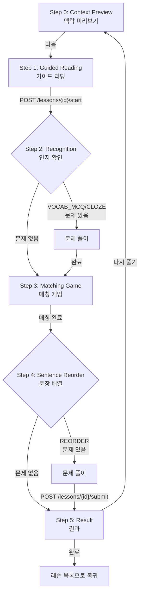

# 레슨 학습 플로우

> **Canonical**: Mobile | **Source**: `lesson-flow-design.md` (Frozen)

---

## 진입 경로

| 경로 | 설명 |
|------|------|
| 홈 → Quick Start 카드 | 카테고리 선택 → 학습 진입 결정 로직 |
| 학습 탭 → 레슨 목록 | 챕터 아코디언 → 레슨 타일 탭 |

### 학습 진입 결정 (Study Entry Flow)

```
사용자가 카테고리 선택
    ↓
미완료 세션 있음? → "이어하기 / 새로 시작" 모달
    ↓ (없으면)
Smart Preview 있음? → "오늘의 학습" 시트 표시
    ↓ (없으면)
연습 페이지로 이동
```

---

## 레슨 6단계 플로우

### 전체 흐름



---

### Step 0: Context Preview (맥락 미리보기)

**표시 내용**:
- 챕터 번호 배지 (Ch.{number})
- 레슨 제목 + 예상 소요 시간
- 오늘의 상황 카드 (scene)
- 핵심 표현 태그
- 대화문 미리보기 (화자 + 번역)
- 어휘 목록 (단어, 읽기, 의미, 품사)
- 문법 패턴 목록 (패턴, 의미, 설명)

**사용자 행동**: "다음" 버튼 탭 → Step 1로 이동

**뒤로가기**: 이 단계에서만 시스템 뒤로가기 허용 (레슨 목록으로 복귀)

---

### Step 1: Guided Reading (가이드 리딩)

**표시 내용**:
- 전체 대화문 + 오디오 재생
- 화자 이름 + 번역 표시
- 어휘/문법 참고 카드

**사용자 행동**: 읽기 + 듣기 후 "다음" 탭

**API 호출**: `POST /lessons/{lessonId}/start`
- 레슨 진행 기록 시작
- 어떤 Practice 단계를 보여줄지 결정:
  - `hasRecognitionStep`: VOCAB_MCQ 또는 CONTEXT_CLOZE 문제 존재 여부
  - `hasReorderStep`: SENTENCE_REORDER 문제 존재 여부

---

### Step 2: Recognition (인지 확인)

**조건**: VOCAB_MCQ 또는 CONTEXT_CLOZE 문제가 있을 때만 표시

**문제 유형**:
- **VOCAB_MCQ**: 4지선다 단어 선택
- **CONTEXT_CLOZE**: 빈칸 채우기

**표시 내용**:
- 문제 프롬프트
- 4개 선택지
- 진행률 표시 (현재/전체)

**사용자 행동**:
- 답 선택 → 다음 문제 (같은 Step 내에서 index 이동)
- 마지막 문제 답변 → Step 3으로 자동 전환
- "건너뛰기" → Step 3으로 즉시 이동

---

### Step 3: Matching Game (매칭 게임)

**조건**: 항상 표시

**표시 내용**:
- 일본어 단어 + 읽기 (왼쪽)
- 한국어 의미 (오른쪽, 셔플)

**사용자 행동**:
- 왼쪽 탭 → 오른쪽 탭 → 매칭 확인
- 전체 매칭 완료 시:
  - Reorder 문제 있음 → Step 4
  - Reorder 문제 없음 → 답안 제출 → Step 5

---

### Step 4: Sentence Reorder (문장 배열)

**조건**: SENTENCE_REORDER 문제가 있을 때만 표시

**표시 내용**:
- 문제 프롬프트
- 섞인 토큰들 (단어/구)
- 진행률 표시

**사용자 행동**:
- 토큰을 올바른 순서로 배열
- "완료" 탭 → 정답 검증
- 마지막 문제 → 답안 제출 → Step 5

---

### Step 5: Result (결과)

**API 호출**: `POST /lessons/{lessonId}/submit`
- 답안 일괄 제출
- 서버에서 채점 + SRS 등록

**표시 내용**:
- 점수 (예: 4/5 정답, 80%)
- 아이콘: 🏆 (만점) / 📋 (완료)
- SRS 등록 카드: "{count}개 항목이 복습 예약되었습니다"
- 문제별 피드백:
  - 유형 + 프롬프트
  - 내 답 vs 정답
  - 설명
  - SRS 상태 전이 (Before → After)
  - 다음 복습 날짜

**사용자 행동**:
- "다시 풀기" → Step 0으로 리셋
- "완료" → 레슨 목록으로 복귀

**Provider 갱신**:
- `chaptersProvider` → 챕터 진행률 갱신
- `reviewSummaryProvider` → 복습 요약 갱신
- `dashboardProvider` → 홈 통계 갱신

---

## 레슨 상태

| 상태 | 조건 | 표시 |
|------|------|------|
| NOT_STARTED | 아직 시작 안 함 | 기본 상태 / 추천 레슨 강조 가능 |
| IN_PROGRESS | 시작했지만 미완료 | 진행 중 표시 |
| COMPLETED | 제출 완료 | 점수 배지 (예: "4/5") |

## 챕터 진행

- 챕터 = 레슨 그룹 (예: Ch.01 인사와 첫 만남)
- 진행률: `completedLessons / totalLessons`
- 레슨 순서는 권장 학습 순서를 제공하지만, 직접 진입을 막지는 않음
- 첫 미완료 레슨 또는 최근 이어할 레슨을 추천 진입점으로 사용 가능

---

> **Web MVP Delta**: Web에는 레슨 기능이 없음. 퀴즈 중심의 학습만 지원.
