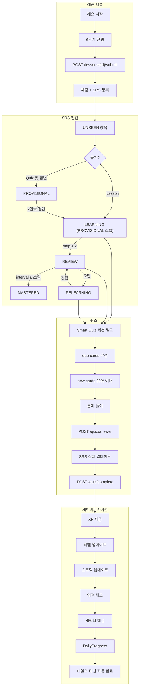
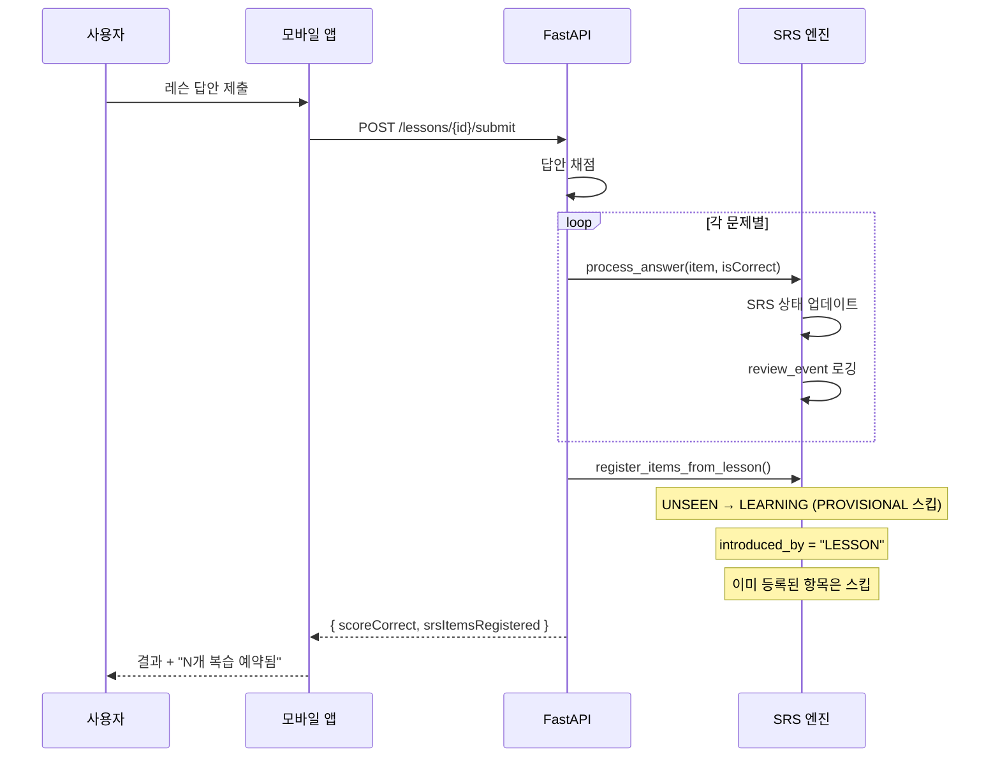
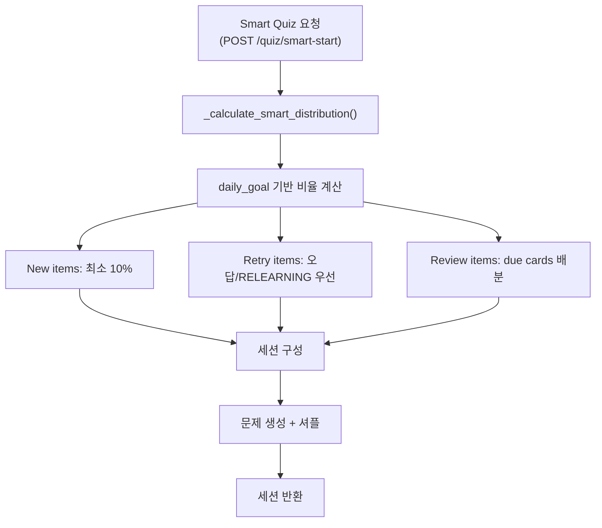
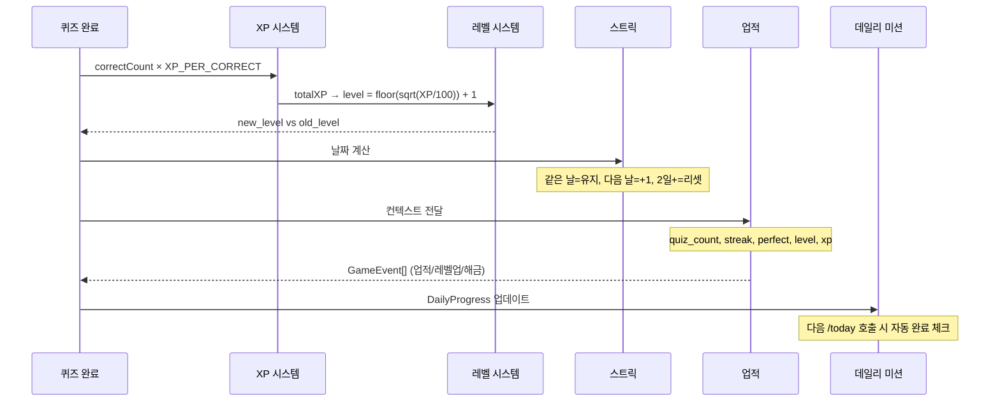

# Lesson → SRS → Quiz → Gamification 연결

> **Canonical**: Mobile | **Source**: `srs-engine.md`, `lesson-flow-design.md` (Frozen)

---

## 전체 연결 다이어그램



---

## 1. Lesson → SRS 등록

### 레슨 완료 시 SRS 등록 규칙



### 핵심 규칙
- 레슨 항목은 **PROVISIONAL을 건너뛰고 바로 LEARNING**
- 이유: 레슨은 큐레이팅된 콘텐츠 → 찍기(guessing) 위험 없음
- `introduced_by = "LESSON"` 기록 (분석용)
- 이미 SRS에 등록된 항목은 중복 등록하지 않음

---

## 2. SRS → Quiz 세션 빌드

### Smart Quiz 세션 구성 알고리즘

`_calculate_smart_distribution()` + `/quiz/smart-start` 기반:



### 세션 구성 규칙
- **New items**: 최소 10% (학습 진행 보장)
- **Retry items**: 오답/RELEARNING 우선 배정
- **Review items**: due cards 비율 배분
- **daily_goal 기반**: 유저별 목표에 따라 분배 비율 조정

---

## 3. Quiz → SRS 업데이트

### 답변별 SRS 상태 전이

| 현재 상태 | 정답 | 오답 |
|----------|------|------|
| UNSEEN | → PROVISIONAL (step 0) | → PROVISIONAL (step 0) |
| PROVISIONAL (step 0) | → step 1 (1일 후 복습) | → step 0 리셋 (1일 후) |
| PROVISIONAL (step 1) | → LEARNING (3일 후) | → step 0 리셋 (1일 후) |
| LEARNING (step 0) | → step 1 (1일 후) | → step 0 리셋 (1일 후) |
| LEARNING (step 1) | → REVIEW (interval × EF일 후) | → step 0 리셋 (1일 후) |
| REVIEW | → interval 증가 (EF 적용) | → RELEARNING |
| MASTERED | (유지) | → RELEARNING |
| RELEARNING | → REVIEW | → RELEARNING (리셋) |

---

## 4. Quiz → Gamification

### XP 지급 체인



### 업적 트리거 조건

| 업적 | 조건 | 트리거 시점 |
|------|------|-----------|
| first_quiz | quiz_count ≥ 1 | 퀴즈 완료 |
| quiz_10/50/100 | quiz_count ≥ N | 퀴즈 완료 |
| perfect_quiz | is_perfect_quiz = true | 퀴즈 완료 (만점) |
| streak_3/7/30/100 | streak_count ≥ N | 퀴즈/대화 완료 |
| words_50/100 | total_words ≥ N | 퀴즈 완료 |
| level_5/10/20 | level ≥ N | 퀴즈/대화 완료 |
| xp_1000/5000/10000 | total_xp ≥ N | 퀴즈/대화 완료 |
| first_conversation | conversation_count ≥ 1 | 대화 완료 |
| kana_hiragana_complete | 히라가나 전체 마스터 | 가나 퀴즈 완료 |

### 데일리 미션 자동 완료

```
사용자가 퀴즈 완료
    ↓
DailyProgress 업데이트 (quizzes_completed++, words_studied++, ...)
    ↓
다음 번 GET /missions/today 호출 시
    ↓
각 미션의 target_count vs DailyProgress 비교
    ↓
달성 시 자동 XP 지급 + reward_claimed = true
```

---

## 5. 대화(Chat) → Gamification

대화/음성통화도 동일한 게이미피케이션 체인을 거침:

```
대화 완료 (POST /chat/end 또는 /chat/live-feedback)
    ↓
XP 지급: CONVERSATION_COMPLETE_XP (고정)
    ↓
스트릭 업데이트
    ↓
업적 체크 (conversation_count, streak, level)
    ↓
DailyProgress: xp_earned++, study_minutes++ (conversation_count는 별도 업데이트 없음)
```

> **Web MVP Delta**: Web에서도 퀴즈 완료 → SRS → 게이미피케이션 동일 체인 동작. 단, Smart Quiz와 레슨 기반 SRS 등록은 미지원.
