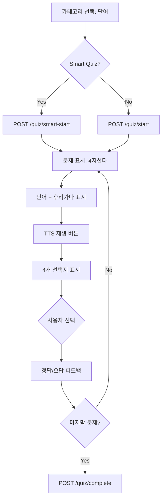
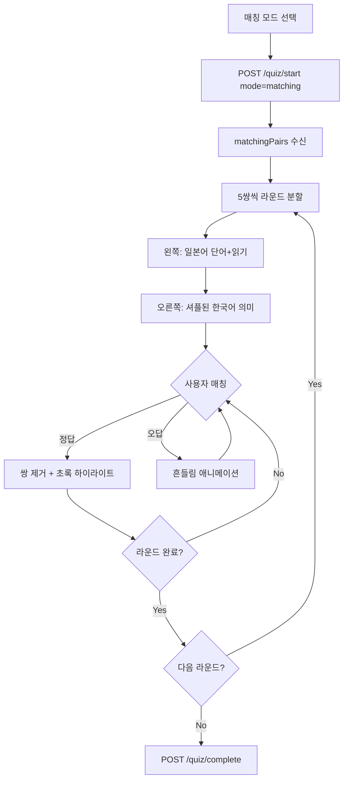
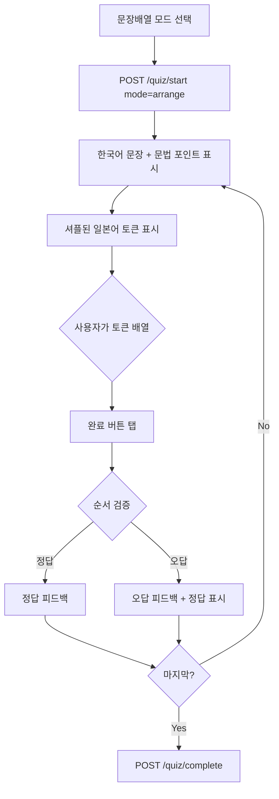
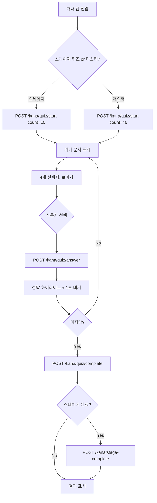

# 퀴즈 카테고리별 규칙

> **Canonical**: Mobile | **Source**: `quiz-track.md` (Frozen)

---

## QuizType(카테고리) vs Mode(모드) 구분

**QuizType** (DB enum, 카테고리): VOCABULARY, GRAMMAR, KANJI, LISTENING, KANA, CLOZE, SENTENCE_ARRANGE
**Mode** (API body 파라미터, 문제 표시 방식): smart, review, matching, cloze, arrange, typing

> QuizType은 "무엇을 학습하는가", Mode는 "어떤 형식으로 풀 것인가"

## 카테고리 전체 매트릭스

| QuizType (카테고리) | 기본 위젯 | Smart 지원 | SRS 연동 | 비고 |
|---------|------|:----------:|:--------:|------|
| **VOCABULARY** | FourChoiceQuiz | ✅ | ✅ | mode로 matching/cloze/arrange/typing 전환 가능 |
| **GRAMMAR** | FourChoiceQuiz | ✅ | ✅ | mode로 matching/cloze/arrange/typing 전환 가능 |
| **KANJI** | FourChoiceQuiz | - | ✅ | VOCABULARY와 동일 UI |
| **LISTENING** | FourChoiceQuiz | - | ✅ | VOCABULARY와 동일 UI + TTS |
| **KANA** | KanaQuizPage | - | 별도 | 별도 API (`/kana/quiz/*`) |
| **CLOZE** | ClozeQuiz | - | ❌ | SRS 미연동 (답변 기록만) |
| **SENTENCE_ARRANGE** | SentenceArrangeQuiz | - | ❌ | SRS 미연동 (답변 기록만) |

| Mode (표시 방식) | 위젯 | 타이머 | 적용 가능 QuizType |
|---------|------|:------:|------|
| *(기본)* | FourChoiceQuiz | ✅ | VOCABULARY, GRAMMAR, KANJI, LISTENING |
| **matching** | MatchingQuiz | - | VOCABULARY, GRAMMAR |
| **cloze** | ClozeQuiz | - | VOCABULARY, GRAMMAR |
| **arrange** | SentenceArrangeQuiz | - | VOCABULARY, GRAMMAR |
| **typing** | TypingQuiz (비활성) | - | VOCABULARY, GRAMMAR |
| **smart** | FourChoiceQuiz | ✅ | VOCABULARY, GRAMMAR |
| **review** | FourChoiceQuiz | ✅ | VOCABULARY, GRAMMAR |

> Mode는 API body의 `mode` 필드로 전달 (query parameter 아님)

---

## 1. VOCABULARY (단어 퀴즈)

### 플로우



### 문제 구조
- **questionText**: 일본어 단어 (예: "食べる")
- **questionSubText**: 후리가나 (예: "たべる")
- **options**: 4개 한국어 의미
- **TTS**: `/vocab/tts` 엔드포인트로 음성 재생

### Smart Quiz 알고리즘
`_calculate_smart_distribution()` 기반:
- New items: 최소 10% (학습 진행 보장)
- Retry items: 오답/RELEARNING 우선
- Review items: due cards 비율 배분
- daily_goal 기반 분배 (유저별 맞춤)

### SRS 업데이트
- 정답 → ease_factor + 0.1, interval 증가
- 오답 → ease_factor - 0.2 (최소 1.3), interval 감소

> **Web MVP Delta**: Smart Quiz 미지원. 일반 4지선다만 가능.

---

## 2. GRAMMAR (문법 퀴즈)

### 플로우
VOCABULARY와 동일한 4지선다 위젯 사용.

### 문제 구조
- **questionText**: 문법 패턴 (예: "〜てから")
- **options**: 4개 한국어 의미/용법
- Smart Quiz 지원 (VOCABULARY와 동일 알고리즘)

### DailyProgress 기록
- `grammar_studied` 필드에 정답 수 기록

> **Web MVP Delta**: Smart Quiz 미지원.

---

## 3. MATCHING (매칭 퀴즈)

### 플로우



### 규칙
- 라운드당 5쌍
- 왼쪽 탭 → 오른쪽 탭 → 매칭 확인
- 맞으면 쌍 제거, 틀리면 흔들림
- API 응답이 `matchingPairs`로 다름 (일반 questions 아님)
- `timeSpentSeconds = 0` (타이머 미사용)

> **Web MVP Delta**: 미지원.

---

## 4. CLOZE (빈칸 채우기)

### 플로우

```mermaid
flowchart TD
    A[빈칸 모드 선택] --> B["POST /quiz/start mode=cloze"]
    B --> C[문장 + {blank} 표시]
    C --> D[선택지 표시]
    D --> E{사용자 선택}
    E --> F[정답/오답 피드백]
    F --> G{마지막?}
    G -->|No| C
    G -->|Yes| H[POST /quiz/complete]
```

### 문제 구조
- **sentence**: "あの{blank}は美しい" → `{blank}` 기준으로 분할 렌더링
- **options**: 빈칸에 들어갈 선택지
- **correctAnswer**: 정답
- **grammarPoint**: 관련 문법 포인트

### DailyProgress 기록
- `sentences_studied` 필드에 정답 수 기록

> **Web MVP Delta**: 미지원.

---

## 5. SENTENCE_ARRANGE (문장 배열)

### 플로우



### 문제 구조
- **koreanSentence**: 한국어 번역 (프롬프트)
- **tokens**: 셔플된 일본어 단어/구 배열
- **검증**: `selectedTokens.join() == tokens.join()` (원래 순서와 비교)

### DailyProgress 기록
- `sentences_studied` 필드에 정답 수 기록

> **Web MVP Delta**: 미지원.

---

## 6. KANA (가나 퀴즈)

### 별도 플로우



### VOCABULARY/GRAMMAR와의 차이
| 항목 | 일반 퀴즈 | 가나 퀴즈 |
|------|----------|----------|
| API prefix | `/quiz/*` | `/kana/quiz/*` |
| 피드백 방식 | 피드백 바 + 수동 "다음" | 자동 1초 후 다음 |
| SRS | SM-2 기반 | 별도 스테이지 진행 |
| 모드 | 인식(recognition) / 회상(recall) | recognition / recall |
| 완료 후 | 결과 페이지 | 결과 + 스테이지 완료 처리 |

### 스테이지 시스템
- 히라가나: 기본 → 탁음 → 요음 (스테이지별 잠금해제)
- 가타카나: 동일 구조
- 마스터 퀴즈: 전체 46자 (스테이지 무관)

> **Web MVP Delta**: Web에서도 가나 학습 지원. 동일한 스테이지 시스템 사용.

---

## 7. TYPING (타이핑 퀴즈)

### 현재 상태: **비활성화**

### 설계 (구현됨, UI에서 비활성화)
- **prompt**: "りんご는 무슨 뜻?"
- **입력**: TextEdit 필드에 직접 입력
- **검증**: `userAnswer.toLowerCase() == answer.toLowerCase()`
- 대소문자 무시

> 향후 재활성화 시 별도 플로우 문서 업데이트 필요.

---

## API 엔드포인트 매핑

> 모든 파라미터는 **request body**로 전달 (query parameter 아님)

| QuizType | Start | body.mode | Answer | Complete |
|---------|-------|-----------|--------|----------|
| VOCABULARY | `POST /quiz/start` | *(생략)* / matching / cloze / arrange | `POST /quiz/answer` | `POST /quiz/complete` |
| VOCABULARY (Smart) | `POST /quiz/smart-start` | - | `POST /quiz/answer` | `POST /quiz/complete` |
| GRAMMAR | `POST /quiz/start` | *(생략)* / matching / cloze / arrange | `POST /quiz/answer` | `POST /quiz/complete` |
| KANJI | `POST /quiz/start` | - | `POST /quiz/answer` | `POST /quiz/complete` |
| LISTENING | `POST /quiz/start` | - | `POST /quiz/answer` | `POST /quiz/complete` |
| CLOZE | `POST /quiz/start` | cloze | `POST /quiz/answer` | `POST /quiz/complete` |
| SENTENCE_ARRANGE | `POST /quiz/start` | arrange | `POST /quiz/answer` | `POST /quiz/complete` |
| KANA | `POST /kana/quiz/start` | - | `POST /kana/quiz/answer` | `POST /kana/quiz/complete` |
