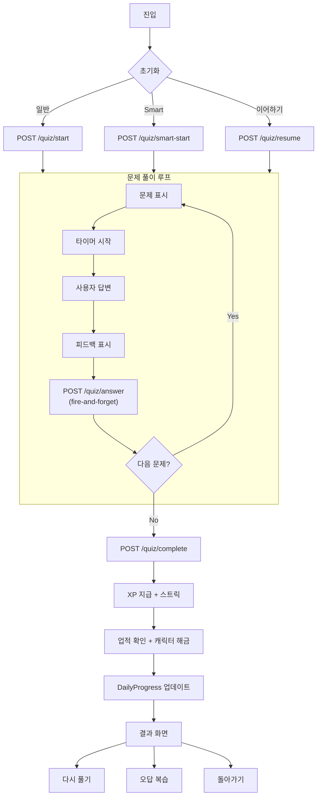

# 퀴즈 공통 라이프사이클

> **Canonical**: Mobile | **Source**: `quiz-track.md` (Frozen)

---

## 진입 경로

| 경로 | 설명 |
|------|------|
| 퀴즈 탭 → 카테고리 선택 | Practice 페이지에서 카테고리+모드 선택 |
| 홈 → Quick Start 카드 | 카테고리 선택 → Smart Preview → 퀴즈 시작 |
| 결과 → 오답 복습 | 퀴즈 결과에서 "오답 복습" 버튼 |
| 미완료 세션 배너 | "진행 중인 학습이 있어요" → 이어하기 |

---

## 공통 퀴즈 라이프사이클



---

## 1. 초기화

### 일반 퀴즈 시작
```
POST /quiz/start
{
  quizType: "VOCABULARY" | "GRAMMAR" | ...
  jlptLevel: "N5" | "N4" | ...
  count: 10 | 20
  mode?: "review" | "matching" | "cloze" | "arrange"
  stageId?: string
}
→ { sessionId, questions[] }
```

### Smart 퀴즈 시작
```
POST /quiz/smart-start
{
  category: "VOCABULARY" | "GRAMMAR"
  jlptLevel: "N5"
  count: int
}
→ { sessionId, questions[] }
```
SRS 알고리즘이 자동 선별: due cards(복습 예정) + new cards(신규) 혼합

### 이어하기
```
POST /quiz/resume
{ sessionId: string }
→ { sessionId, questions[], answeredQuestionIds[], correctCount }
```
이미 답변한 문제는 건너뜀 (`currentIndex = answeredQuestionIds.length`)

---

## 2. 문제 풀이

### 답변 제출 (Fire-and-forget)
```
POST /quiz/answer
{
  sessionId, questionId, selectedOptionId,
  isCorrect, timeSpentSeconds, questionType
}
```
- UI를 블로킹하지 않음 (await 없이 전송)
- 네트워크 실패 시 UI에 영향 없음

### 피드백 바
| 상태 | 메시지 | 색상 |
|------|--------|------|
| 정답 | "정답이에요!" | 초록 (#34A853) |
| 오답 | "아쉬워요!" | 빨강 (#EA4335) |
| 연속 정답 (3+) | "연속 정답!" + 🔥 | 초록 + 불꽃 |
| 연속 정답 (5+) | "대단해요!" + 🔥 | 초록 + 불꽃 |

### 스트릭 계산
```
정답 → streak += 1
오답 → streak = 0
```
- 3+ 연속 시 콤보 사운드 + 피드백
- 5+ 연속 시 특별 메시지

### 타이머
- 일반 모드: 문제당 시간 측정 (`timeSpentSeconds`)
- 특수 모드 (Matching/Cloze/Arrange): 타이머 없음 (`timeSpentSeconds = 0`)

---

## 3. 퀴즈 완료

### 완료 API
```
POST /quiz/complete
{ sessionId, stageId? }
→ {
    correctCount, totalQuestions, xpEarned, accuracy,
    currentXp, xpForNext, level,
    events: GameEvent[]
  }
```

### 서버 처리 순서
1. 세션 완료 표시 (`completed_at = now`)
2. XP 계산: `correctCount × QUIZ_XP_PER_CORRECT`
3. 유저 XP + 레벨 업데이트
4. 스트릭 업데이트 (같은 날 = 유지, 다음 날 = +1, 2일+ 공백 = 리셋)
5. DailyProgress upsert (퀴즈 수, 정답 수, XP, 학습 시간 등)
6. 업적 체크 (퀴즈 수, 스트릭, 만점, 레벨, XP 등)
7. 캐릭터 해금 체크 (레벨 조건)
8. GameEvent 목록 반환

### 멱등성 보장
```python
if session.completed_at:
    return { xp_earned: 0 }  # 이미 완료됨 → 중복 XP 방지
```

---

## 4. 결과 화면

### 표시 내용
- 정확도에 따른 메시지:
  - ≥80%: 🎉 "훌륭해요!" + 컨페티 애니메이션
  - ≥50%: 👍 "잘 하셨어요!"
  - <50%: 💪 "다음엔 더 잘할 수 있어요!"
- 점수: X/Y 정답, 정확도 %, 획득 XP
- 레벨 진행: 현재 XP → 다음 레벨까지
- 레벨업 시 애니메이션
- 오답 목록 (GET /quiz/wrong-answers)
- 단어장 저장 버튼

### 사용자 행동
| 버튼 | 동작 |
|------|------|
| 다시 풀기 | 같은 설정으로 새 퀴즈 시작 |
| 오답 복습 | `mode: 'review'`로 오답만 재시험 |
| 돌아가기 | 이전 화면으로 복귀 |

### Provider 갱신
완료 시 자동 갱신되는 화면:
- `incompleteQuizProvider` → 미완료 세션 배너
- `smartPreviewProvider` → Smart 퀴즈 미리보기
- `reviewSummaryProvider` → 복습 요약
- `dashboardProvider` → 홈 대시보드

---

> **Web MVP Delta**: Web도 동일한 퀴즈 라이프사이클을 사용하지만, Smart Quiz, Matching, Cloze, Sentence Arrange 모드는 미지원. 4지선다(VOCABULARY/GRAMMAR)만 가능.
