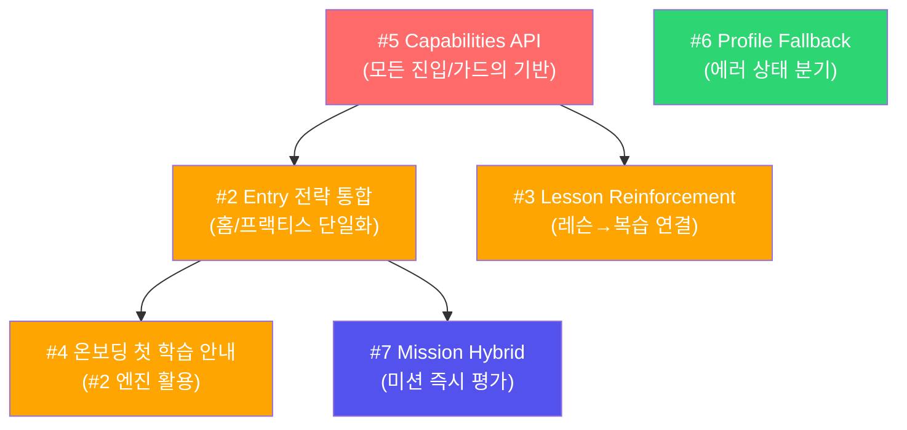
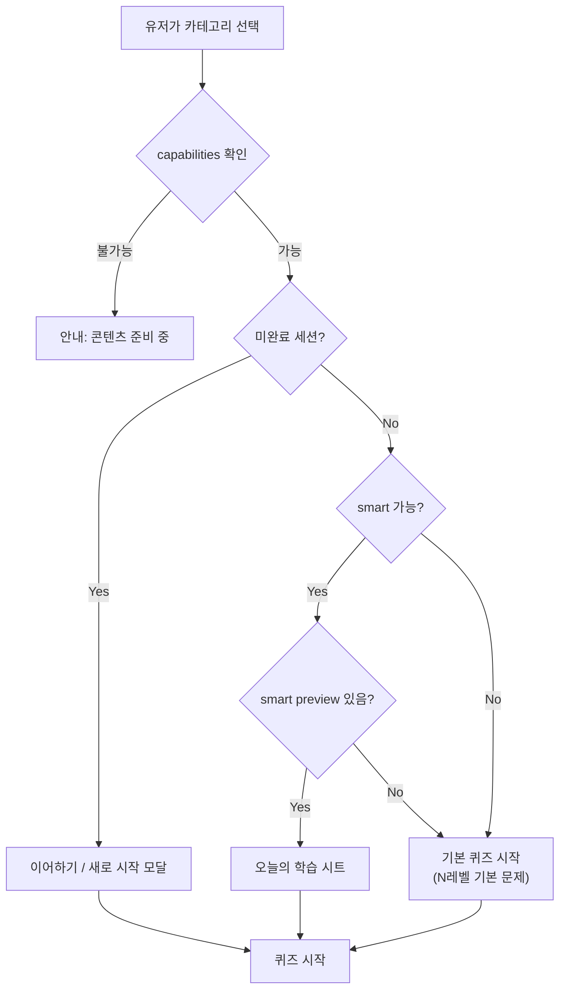
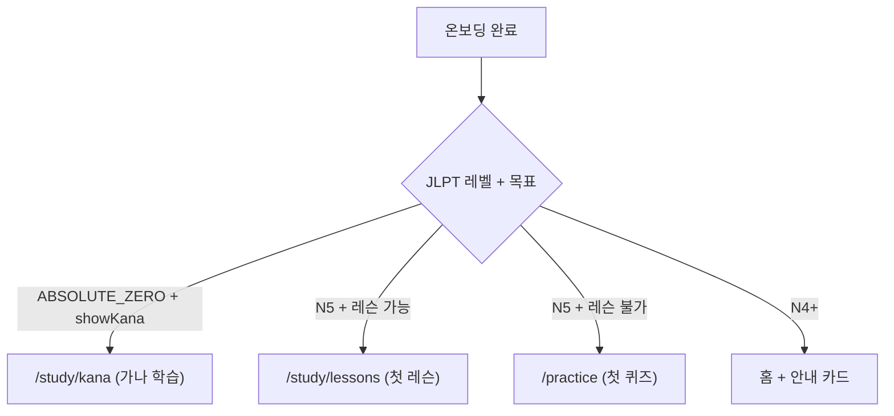
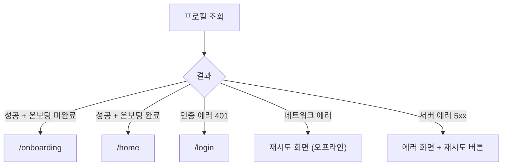
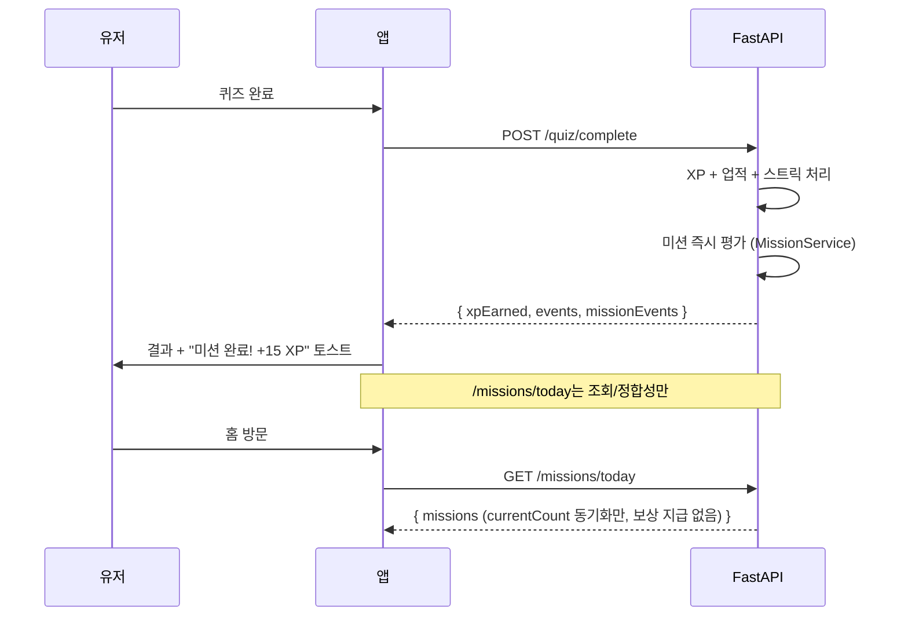

# Sprint 1: 올바른 접근 기준 실행 계획

> **작성일**: 2026-03-25
> **원칙**: 임시 해결(quick fix)이 아닌 근본 원인 해결(correct approach)
> **검증**: Claude Code + Codex MCP 토론 합의

---

## 핵심 원칙

> **"증상에 반창고를 붙이지 않는다. 왜 아픈지를 먼저 파악한다."**

각 작업에 대해:
- ❌ **임시 해결**: 버튼 추가, fallback 분기, 조건 패치
- ✅ **올바른 접근**: 구조적 원인 해소, 단일 소스 정책, 아키텍처 정합성

---

## 실행 순서 (의존성 기준)



**순서 이유**:
1. `#5 Capabilities`가 기반 — 이것 없이 #2, #4는 또 다른 하드코딩
2. `#2 Entry 통합`이 #4의 전제 — 통합된 진입 엔진이 있어야 온보딩 안내가 일관됨
3. `#6`은 독립 — 언제든 가능
4. `#7`은 여러 엔드포인트 횡단 — 마지막에 통합

---

## #5 기능별 가용성 매트릭스 (기반 작업)

### 근본 원인
N4+ 콘텐츠가 없는 상태에서 유저가 N4를 선택할 수 있고, 각 화면이 독자적으로 "있다/없다"를 판단하여 불일치 발생.

### ❌ 임시 해결
"N4 선택 시 화면에 `준비 중` 텍스트 표시" → 하드코딩 가드. N4 콘텐츠 추가되면 제거 필요.

### ✅ 올바른 접근
서버가 **기능별 가용성 매트릭스**를 제공. 모든 화면이 동일 소스로 판단.

### API 설계

```
GET /api/v1/study/capabilities?jlptLevel=N4

Response:
{
  "requestedJlptLevel": "N4",
  "effectiveJlptLevel": "N4",
  "quiz": {
    "VOCABULARY": true,    // N4 어휘 시드 있음
    "GRAMMAR": true,       // N4 문법 시드 있음
    "KANJI": false,
    "LISTENING": false,
    "CLOZE": false,
    "SENTENCE_ARRANGE": false
  },
  "smart": {
    "VOCABULARY": false,   // N4 SRS pool 없음 (아직 학습 전)
    "GRAMMAR": false
  },
  "lesson": false,         // N4 레슨 미준비
  "stage": {
    "VOCABULARY": false,
    "GRAMMAR": false,
    "SENTENCE": false
  },
  "fallbackJlptLevel": "N5"
}
```

**핵심**: `ABSOLUTE_ZERO → N5` 매핑도 서버에서 `effectiveJlptLevel`로 처리.

### 구현 범위

| 영역 | 변경 |
|------|------|
| **API** | `apps/api/app/routers/study.py`에 `/capabilities` 엔드포인트 추가 |
| **API 로직** | DB에서 레벨별 콘텐츠 count 집계 → boolean 변환 |
| **Mobile** | `study_provider.dart`에 `capabilitiesProvider` 추가 |
| **Mobile** | 홈/프랙티스/레슨 목록에서 capabilities 참조 |

### 완료 기준
- N5 유저: 모든 기능 `true`
- N4 유저: quiz만 `true`, lesson/stage/smart `false` + UI에 안내 표시
- ABSOLUTE_ZERO: `effectiveJlptLevel: "N5"`, quiz/lesson 가능

---

## #2 진입 전략 통합 (Day 1 Quick Start 해소)

### 근본 원인
진입 의사결정이 `Smart Preview 존재 여부`에 과의존. 홈과 프랙티스 탭의 decision 로직이 분리되어 있어 동일 유저가 화면마다 다른 결과를 받음.

### ❌ 임시 해결
"Smart Preview 없으면 기본 10문제 퀴즈 제공" → 화면 불일치 남음, 재발 가능.

### ✅ 올바른 접근
`study_entry_flow.dart`를 **"start 가능 여부"** 기준으로 리팩토링. `#5 capabilities`를 단일 소스로 사용.

### 진입 전략 재설계



**핵심 변경**: `unavailable` 상태 제거. capabilities가 `true`면 반드시 시작 가능한 경로 존재.

### 구현 범위

| 영역 | 변경 |
|------|------|
| **Mobile** | `study_entry_flow.dart` 리팩토링 — capabilities 기반 판단 |
| **Mobile** | `quick_start_card.dart` — `allowPracticeFallback` 제거, capabilities 참조 |
| **Mobile** | `practice_page.dart` — 동일 entry 로직 사용 |

### 완료 기준
- Day 1 유저: VOCABULARY/GRAMMAR Quick Start에서 퀴즈 시작 가능
- 홈과 프랙티스 탭에서 동일한 진입 결과
- N4+ 유저: capabilities 기반 안내 표시

---

## #4 온보딩 → 첫 학습 안내

### 근본 원인
온보딩은 프로필 수집까지만 하고 "첫 행동"을 설계하지 않았음. 홈은 정보가 많아 첫 액션 우선순위가 불명확.

### ❌ 임시 해결
"홈 상단에 원타임 배너 추가" → 또 다른 UI 요소 추가. 근본적으로 "첫 행동이 뭔지" 안내 안 됨.

### ✅ 올바른 접근
온보딩 완료 시 `#2의 진입 전략 엔진`을 활용해 **첫 액션을 계산하고 바로 deep-link**.

### 설계



**핵심**: 온보딩이 "프로필 수집 → 끝"이 아니라 "프로필 수집 → 첫 학습 시작"까지 책임.

### 구현 범위

| 영역 | 변경 |
|------|------|
| **Mobile** | `onboarding_page.dart` — 완료 후 capabilities + entry 전략으로 첫 목적지 결정 |
| **Mobile** | 첫 방문 플래그 (`isFirstVisit`) — 홈에서 추가 안내 표시용 |

### 완료 기준
- 온보딩 완료 → 즉시 학습 화면으로 이동 (홈 경유 없음)
- 유저가 "이제 뭘 하지?" 상태에 놓이지 않음

---

## #3 Lesson Reinforcement Mode

### 근본 원인
레슨과 퀴즈 사이에 "즉시 보강(reinforcement)" 개념이 없음. SRS 등록 후 `next_review_at = +1일`이라 same-day 복습 불가. 레슨과 퀴즈가 아키텍처적으로 분리.

### ❌ 임시 해결
"결과 화면에 버튼 추가 → 일반 퀴즈로 보내기" → 레슨 항목이 아닌 랜덤 문제 출제. UX 착시.

### ✅ 올바른 접근
`lesson_reinforcement` 모드를 정의. 레슨 항목만으로 퀴즈를 생성하되, **SRS interval 갱신 비활성** (same-day 반복에 의한 간격 왜곡 방지).

### API 설계

```
POST /api/v1/quiz/start
{
  "quizType": "VOCABULARY",
  "jlptLevel": "N5",
  "count": 8,
  "mode": "lesson_reinforcement",
  "sourceLessonId": "lesson-uuid-here"
}
```

**서버 동작**:
1. `sourceLessonId`의 `lesson_item_links`에서 항목 추출
2. 해당 항목으로 퀴즈 문제 생성
3. 세션 메타에 `mode`, `sourceLessonId` 저장
4. `answer` 단계: `mode=lesson_reinforcement`이면 **SRS interval 갱신 비활성**, 정답/오답 기록만
5. `complete`: XP/업적/미션은 정상 동작

**교육 정책 결정**: reinforcement는 SRS interval을 변경하지 않음. 이유: same-day 반복은 간격 반복의 원리에 어긋남. 기록만 남기고 정규 SRS 스케줄은 보존.

### 구현 범위

| 영역 | 변경 |
|------|------|
| **API** | `quiz.py` — `lesson_reinforcement` 모드 분기, `sourceLessonId` 기반 문제 생성 |
| **API** | `quiz.py` answer — reinforcement 모드 SRS 비활성 |
| **Mobile** | `lesson_page.dart` 결과 — "바로 복습" CTA 추가 |
| **Mobile** | `quiz_launch.dart` — `sourceLessonId` 전달 |

### 완료 기준
- 레슨 완료 → "바로 복습" → 해당 레슨 항목만으로 퀴즈 시작
- SRS interval이 왜곡되지 않음
- XP/업적/미션은 정상 동작

---

## #6 프로필 조회 에러 핸들링

### 근본 원인
에러를 분류하지 않고 `catch-all`로 `/home` 이동. 실패를 숨기는 안티패턴.

### ❌ 임시 해결
`catch → /onboarding` fallback → 에러 원인에 관계없이 온보딩으로 보냄.

### ✅ 올바른 접근
에러 유형별 분기:



### 구현 범위

| 영역 | 변경 |
|------|------|
| **Mobile** | `post_auth_resolver.dart` — try/catch를 에러 유형별 분기로 변경 |
| **Mobile** | 재시도/오프라인 UI 추가 (간단한 에러 화면) |

### 완료 기준
- 네트워크 에러 시: 재시도 화면 표시 (홈으로 안 보냄)
- 서버 에러 시: 에러 안내 + 재시도 버튼
- 인증 만료 시: 로그인 화면으로 리다이렉트

---

## #7 미션 하이브리드 평가

### 근본 원인
미션 보상이 `GET /missions/today` 호출 시점에 계산/지급되는 **pull-side-effect** 모델. "달성 순간" 피드백이 구조적으로 불가능.

### ❌ 임시 해결
"퀴즈 완료 후 `/missions/today` 호출 → diff 비교 → 토스트 표시" → 추가 API 호출 + 타이밍 이슈.

### ✅ 올바른 접근
액션 엔드포인트(quiz complete, chat end 등)에서 **미션 즉시 평가**. `/missions/today`는 조회/정합성만.

### 설계



### API 변경

```python
# QuizCompleteResponse 확장
{
  "correctCount": 8,
  "xpEarned": 40,
  "events": [...],         # 기존 GameEvent (업적, 레벨업)
  "missionEvents": [       # 새로 추가
    {"type": "mission_complete", "title": "단어 5개 학습", "xp": 15}
  ]
}
```

### 중복 지급 방지
1. 퀴즈 complete idempotency (이미 존재: `session.completed_at` 체크)
2. 미션별 `reward_claimed` 플래그 — `SELECT ... FOR UPDATE`로 row 잠금 후 지급
3. `/missions/today`에서 XP 변경 로직 완전 제거

### 구현 범위

| 영역 | 변경 |
|------|------|
| **API** | `MissionService` 공통 모듈 추출 (현재 missions.py에 인라인) |
| **API** | `quiz.py` complete — `MissionService.evaluate()` 호출 추가 |
| **API** | `chat.py` end — 동일 |
| **API** | `missions.py` `/today` — 보상 지급 로직 제거, 조회만 |
| **Mobile** | 결과 화면에 `missionEvents` 표시 |

### 완료 기준
- 퀴즈 완료 즉시 미션 달성 피드백 표시
- `/missions/today`는 조회만 (side-effect 없음)
- 중복 XP 지급 없음

---

## 전체 요약

| 순서 | 작업 | 접근 | 복잡도 | 의존성 |
|:----:|------|------|:------:|--------|
| **1** | #5 Capabilities API | 서버 가용성 매트릭스 | M | 없음 (기반) |
| **2** | #2 Entry 전략 통합 | capabilities 기반 단일 판단 | M | #5 |
| **3** | #4 온보딩 첫 학습 | entry 엔진으로 첫 목적지 결정 | M | #2 |
| **4** | #3 Lesson Reinforcement | 레슨 항목 기반 퀴즈 + SRS 비활성 | M~L | #5 |
| **5** | #6 Profile Fallback | 에러 유형별 상태 분기 | S~M | 없음 |
| **6** | #7 Mission Hybrid | 액션 시점 즉시 평가 + 조회 분리 | M~L | 없음 |

### 임시 해결 vs 올바른 접근 대조표

| 작업 | ❌ 임시 해결 | ✅ 올바른 접근 |
|------|-----------|-------------|
| #2 | preview 없으면 10문제 제공 | capabilities + entry 엔진 통합 |
| #3 | 버튼 추가 → 일반 퀴즈로 연결 | reinforcement mode + SRS 비활성 |
| #4 | 홈에 원타임 배너 | 온보딩이 첫 학습까지 책임 |
| #5 | N4 하드코딩 가드 | 서버 가용성 매트릭스 |
| #6 | catch → /onboarding | 에러 유형별 분기 |
| #7 | 퀴즈 후 /today diff 비교 | 액션 시점 즉시 평가 |
