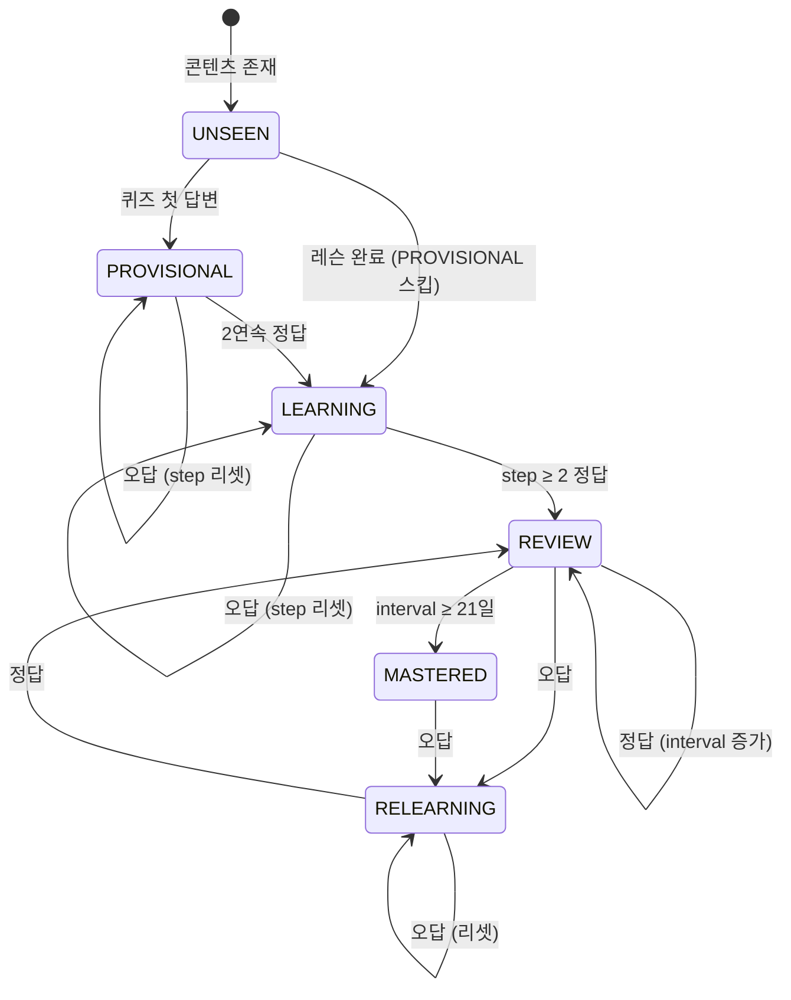
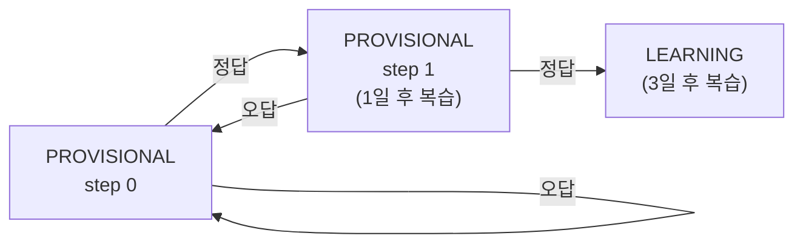
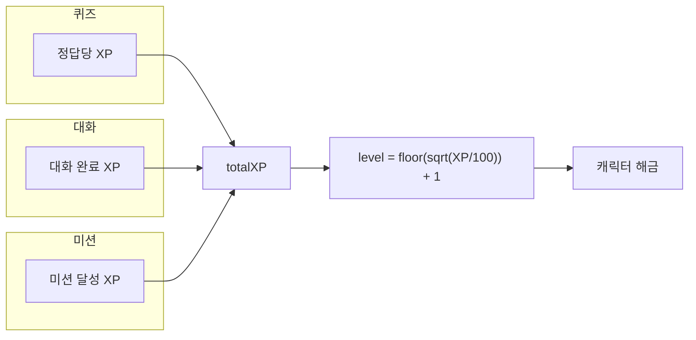
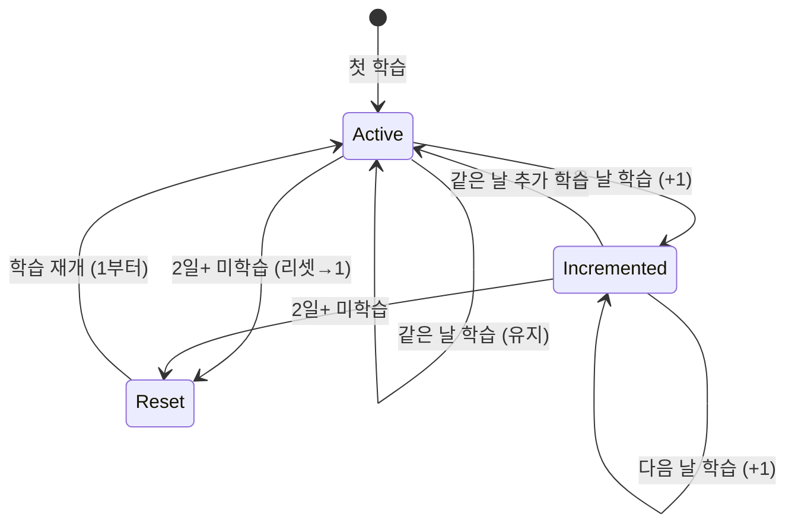
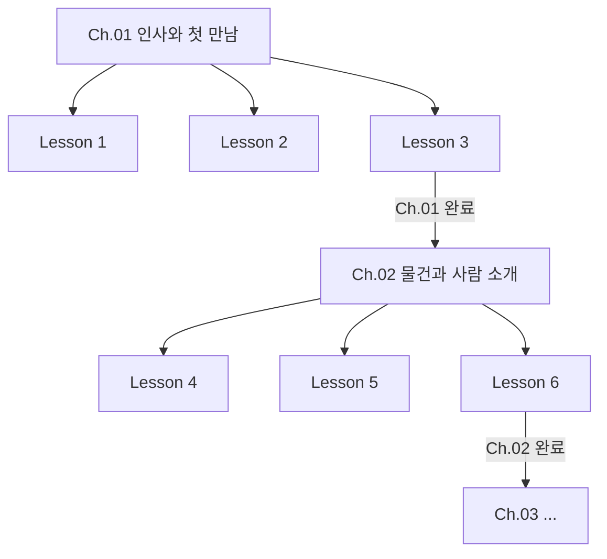
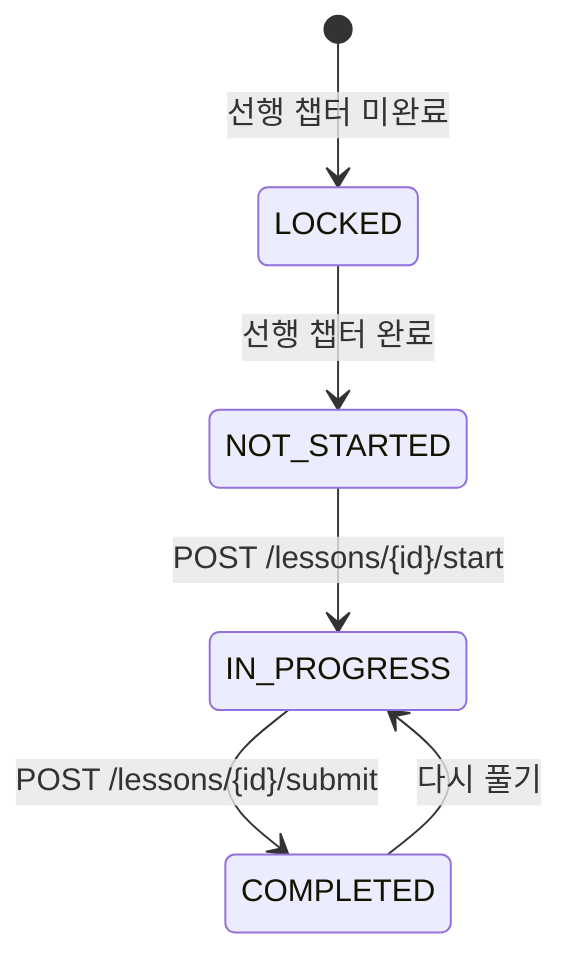
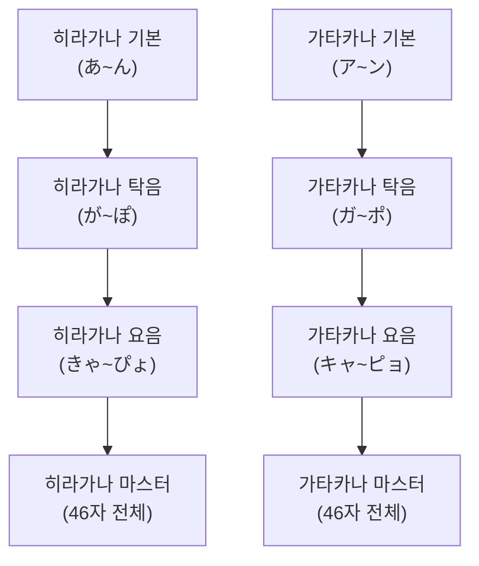

# SRS / 레벨 / 진도 상태 전이

> **Canonical**: Mobile | **Source**: `srs-engine.md` (Frozen)

---

## 1. SRS 아이템 상태 머신

### 전체 상태 다이어그램



### 상태 설명

| 상태 | 의미 | 진입 조건 | 복습 간격 |
|------|------|----------|----------|
| **UNSEEN** | 아직 학습 안 함 | 콘텐츠 등록 시 | - |
| **PROVISIONAL** | 찍기 방지 단계 | 퀴즈 첫 답변 | [1, 3]일 |
| **LEARNING** | 학습 중 | 레슨 완료 / PROVISIONAL 2연속 정답 | [1, 3]일 |
| **REVIEW** | 정기 복습 | LEARNING step ≥ 2 정답 | interval × EF |
| **MASTERED** | 마스터 | interval ≥ 21일 | 장기 |
| **RELEARNING** | 재학습 | REVIEW/MASTERED에서 오답 | 1일 |

### PROVISIONAL 단계 상세



- **목적**: 찍기(guessing) 방지 — 2번 연속 맞혀야 LEARNING 진입
- **필요 조건**: `PROVISIONAL_STEPS_REQUIRED = 2`
- **레슨 항목은 이 단계를 건너뜀** (큐레이팅된 콘텐츠이므로)

### SM-2 알고리즘 (REVIEW 단계)

```
정답:
  interval' = max(int(interval × ease_factor), 1)
  ease_factor' = ease_factor + 0.1

오답:
  interval' = 1
  ease_factor' = max(ease_factor - 0.2, 1.3)
  state → RELEARNING

MASTERED 조건:
  interval ≥ 21일 → 자동 승격
```

---

## 2. 유저 레벨 시스템

### 레벨 공식

```
level = floor(sqrt(totalXP / 100)) + 1
```

| 레벨 | 필요 XP | 누적 XP |
|------|---------|---------|
| 1 | 0 | 0 |
| 2 | 100 | 100 |
| 3 | 300 | 400 |
| 4 | 500 | 900 |
| 5 | 700 | 1,600 |
| 10 | 1,700 | 8,100 |
| 20 | 3,700 | 36,100 |

### XP 획득 경로



---

## 3. 스트릭 시스템

### 상태 전이



### 규칙
| 조건 | 동작 |
|------|------|
| `last_study_date == today` | streak 유지 (변경 없음) |
| `last_study_date == yesterday` | streak += 1, longest_streak 갱신 |
| `last_study_date < yesterday` | streak = 1 (리셋), longest_streak 보존 |

### 트리거
- 퀴즈 완료 (`POST /quiz/complete`)
- 대화 완료 (`POST /chat/end`, `POST /chat/live-feedback`)

---

## 4. 챕터/레슨 진도

### 잠금해제 시스템



### 레슨 상태 전이



### 진행률 계산
- 챕터 진행률: `completedLessons / totalLessons`
- 파트 진행률: `completedChapters / totalChapters`
- N5 전체: 90 레슨, 18 챕터, 3 파트

---

## 5. 가나 스테이지 진도



### 스테이지 완료 조건
- 스테이지 퀴즈 통과 (정확도 기준)
- 완료 시 다음 스테이지 잠금해제
- 마스터 퀴즈: 전체 46자 대상, 별도 업적 부여

---

> **Web MVP Delta**: Web에서도 가나 스테이지는 동일. 레슨/챕터 진도는 Mobile 전용.
